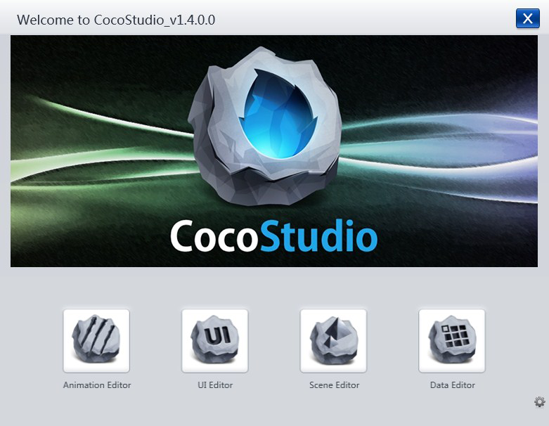

## 简介 
### CocoStudio简介 

#### CocoStudio是一套基于cocos2dx的免费移动游戏开发工具集。
与其它工具喜欢把全部功能集中在一起不同，cocostudio把适用于美术、策划的工具完全分开， 分为UI编辑器，动画编辑器，场景编辑器，数据编辑器， 这四个编辑器分别为UI美术、动作美术、策划、数值策划量身定做。
这样做的目的是希望通过工具的分拆让每一个兵种做自己最擅长的工作， 让美术充分发挥美感，让策划充分发挥创意，而不是要等程序实现好了之后才能看效果。提高游戏的迭代速度，迭代的次数越多，游戏就越有可能成功,同时把功能分拆也极大地降低了团队各兵种的学习难度， 更容易上手，cocostudio衷心地希望可以为广大的移动游戏开发者贡献自己的微薄之力，让大家更容易地做出好游戏！
### 下载CocoStudio 
您可以前往官方网站下载最新版本，新版本包括CocoStudio和对应的解析库。  
[下载地址](http://www.cocoachina.com/bbs/read.php?tid=154886 "")  
特别注明：要想使用cocostudio编辑器所导出的文件，需要一个基于cocos2dx的解析，这套解析是基于cocos2d-x的，而且一定要按照编辑器所要求的解析库版本选择解析库。  
### 安装&卸载 
#### 软件环境要求   

1. Windows XP / Windows 7 / Windows 8
2. 运行库.Net Framework 4.0。
3. Visual C++ 2010 Redistributable
4. Visual C++ 2012 Redistributable  
如果您的计算机没有以上环境，您可以到Micsoft官方网站免费下载.[.Net Framework 4.0](http://www.microsoft.com/zh-cn/download/details.aspx?id=17718 "")、[Visual C++ 2010 Redistributable](http://www.microsoft.com/zh-CN/download/details.aspx?id=5555 "")和[Visual C++ 2012 Redistributable](http://www.microsoft.com/zh-cn/download/details.aspx?id=30679 "")。  
#### 硬件环境需求

1. CPU：2G以上.
2. 内存：1G以上.
3. 硬盘：100M以上(安装所需大小).
#### 安装步骤

1. 打开下载的安装包。
2. 阅览软件使用协议并接受。
3. 点击下一步
4. 自定义安装目录
5. 安装
#### 更新
 
每次打开CocoStudio主程序的时候会自动检测新版本，如果你想检查新版本只需打开CocoStudio.exe，按照提示、选择更新项即可。
更新会卸载旧版本后安装新版本，卸载并不会删除您以前的项目及工程。  
#### 约定

本帮助使用了以下字体和图标约定：  

**粗体**文本：表示用户界面元素，例如菜单项、工具提示或对话框标题。  
*斜体文本*：单击以显示更多信息。这可缩短长主题以让您快速浏览信息。  
表示注释或提示。此非为链接；信息位于图标之后。注释和提示提供省时的步骤和有帮助的提示。
#### 访问帮助
 
当您访问帮助时，文献的 Web 版本在基于 Web 的视图中显示。如果您的 Internet 连接较慢或无法使用，您仍可选择查阅本地帮助文件(.chm [点击下载](http://upyun.cocimg.com/CocoStudio/helpdoc/chm/CocoStudio_User_Guide.chm "") )。  

Copyright © 2013 [CocoStudio.org](http://www.cocostudio.org ""). All Rights Reserved. 版本:1.4.0.0
