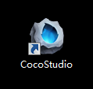
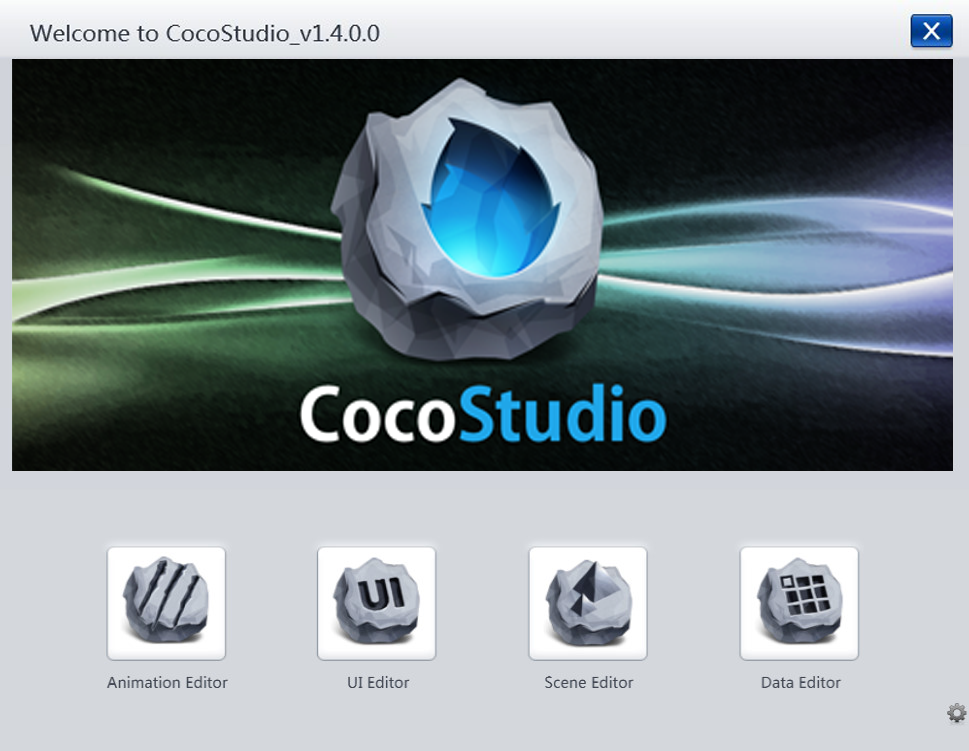
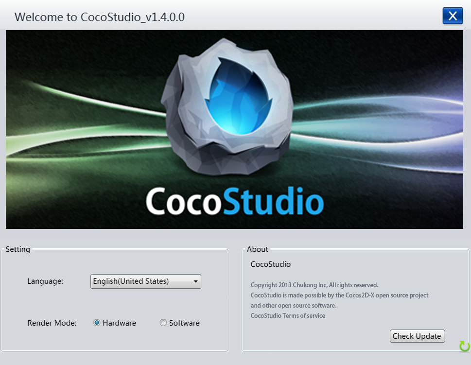

## 开始
### 启动

默认情况下CocoStudio的安装器会在用户的桌面生成一个软件快捷方式（如上图），点击该快捷方式即可启动CocoStudio。如该快捷方式不存在或链接失效，可以直接找到CocoStudio的安装目录，双击运行CocoStudio.exe即可。

### 开始界面
          

上图是启动后的界面，分为LOGO、编辑器启动按钮、设置界面按钮三部分。上半部分为CocoStudio的LOGO，下半部分为依次分别为动作编辑器、UI编辑器、场景编辑器、数值编辑器的启动按钮。右下角是设置界面的开关。点击此开关，底部将旋转到设置界面，如下：

设置界面包括设置与更新两部分内容。

#### 设置/Setting

##### 语言/Language

目前CocoStudio支持中文和英文两种语言。可以通过下拉菜单选择您需要的语言。

##### 渲染模式/Render Mode

CocoStudio 支持两种渲染模式Hardware和Software，可以通过该选项设置渲染模式。使用Hardware可以获取更快的运行速度，使用Software模式可以获取更好的稳定性。

渲染模式的设置并不是一定有效，它需要系统环境的支持。使用Hardware模式可能会在投影仪或截图时发现显示区是黑的，此时建议启用Software模式。

#### 关于/About

##### 关于信息

关于CocoStudio的法律、授权等信息。

##### 检查更新/Check Update

此按钮提供软件检查更新功能，如果需要获取新版本，可以点击此按钮获取CocoStudio的最新版本。

Copyright © 2013 [CocoStudio.org](http://www.cocostudio.org ""). All Rights Reserved. 版本:1.4.0.0

