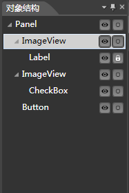
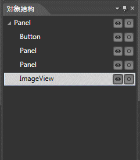
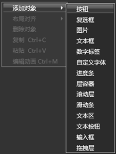
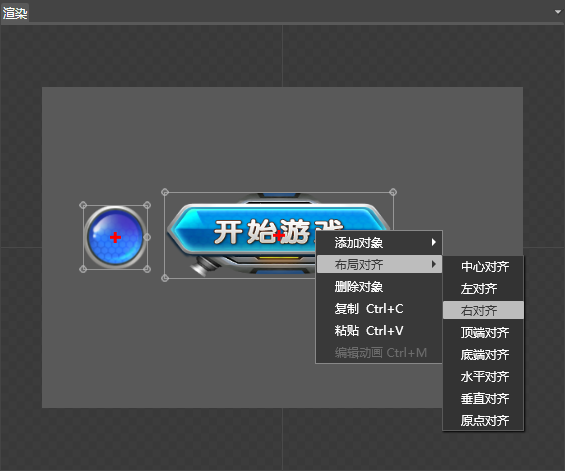
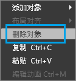
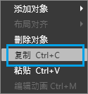
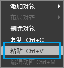
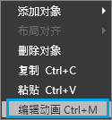

## 对象结构面板

### 简介

对象结构面板提供对UI界面中的所有的控件的管理功能，包括父子关系管理和层级关系管理。结构树的根节点是一个Panel。

### 功能

#### 显示/隐藏

点击结构树上的&quot;小眼睛&quot;图标 设置控件的显示隐藏。

用户可以把一些控件在开始状态下不显示，后期通过代码再显示出来。但是无论显示与否该控件都将被初始化加载到内存中。

#### 锁定/解锁

1. 点击结构树上的&quot;小圆圈&quot;图标 设置控件的锁定/解锁。

2. 控件锁定后将会屏蔽锁定控件的所有操作。

#### 层级调整

1. 通过结构树上鼠标拖拽可以对控件进行层级调整。

2. 如图：拖拽上面的ImageView控件到下面的两个Panel中间是将会出现一条蓝色粗线，松开鼠标后ImageView将会被放在两个Panel的中间，若拖拽到Panel之上，该Panel上将会有蓝色的外框包围，鼠标放下后该ImageView将会成为Panel的子集。

### 右键菜单

#### 添加对象

<table border="1" cellspacing="0" cellpadding="0" >
          	    <tr>
          	    <td width="79"> 按钮</td>
          	      <td width="238">在控件中添加一个按钮作为子控件</td>
       	        </tr>
          	    <tr>
          	      <td>复选框</td>
          	      <td>在控件中添加一个复选框作为子控件</td>
       	        </tr>
          	    <tr>
          	      <td>图片</td>
          	      <td>在控件中添加一个图片作为子控件</td>
       	        </tr>
          	    <tr>
          	      <td>文本框</td>
          	      <td>在控件中添加一个文本框作为子控件</td>
       	        </tr>
          	    <tr>
          	      <td>数字标签</td>
          	      <td>在控件中添加一个数字标签作为子控件</td>
       	        </tr>
          	    <tr>
          	      <td>自定义字体</td>
          	      <td>在控件中添加一个自定义字体作为子控件</td>
       	        </tr>
          	    <tr>
          	      <td>进度条</td>
          	      <td>在控件中添加一个进度条作为子控件</td>
       	        </tr>
          	    <tr>
          	      <td>层容器</td>
          	      <td>在控件中添加一个层容器作为子控件</td>
       	        </tr>
          	    <tr>
          	      <td>滚动层</td>
          	      <td>在控件中添加一个滚动层作为子控件</td>
       	        </tr>
          	    <tr>
          	      <td>滑动条</td>
          	      <td>在控件中添加一个滑动条作为子控件</td>
       	        </tr>
          	    <tr>
          	      <td>文本区</td>
          	      <td>在控件中添加一个文本区作为子控件</td>
       	        </tr>
          	    <tr>
          	      <td>文本按钮</td>
          	      <td>在控件中添加一个文本按钮作为子控件</td>
       	        </tr>
          	    <tr>
          	      <td>输入框</td>
          	      <td>在控件中添加一个输入框作为子控件</td>
       	        </tr>
          	    <tr>
          	      <td>拖拽层</td>
          	      <td>在控件中添加一个拖拽层作为子控件</td>
       	        </tr>
</table>

选中控件右键添加对象时是添加到当前选中的控件上作为它的子集,若没有选中任何控件则添加在根控件上作为子集。

#### 布局对齐

<table border="1" cellspacing="0" cellpadding="0" >
               <tr>
                 <td width="60">中心对齐</td>
                 <td width="161">将所选控件进行中心点对齐</td>
               </tr>
               <tr>
                 <td>左对齐</td>
                 <td>将所选控件进行左对齐</td>
               </tr>
               <tr>
                 <td>右对齐</td>
                 <td>将所选控件进行右对齐</td>
               </tr>
               <tr>
                 <td>顶对齐</td>
                 <td>将所选控件进行顶对齐</td>
               </tr>
               <tr>
                 <td>底端对齐</td>
                 <td>将所选控件进行底端对齐</td>
               </tr>
               <tr>
                 <td>水平对齐</td>
                 <td>将所选控件进行水平对齐</td>
               </tr>
               <tr>
                 <td>垂直对齐</td>
                 <td>将所选控件进行垂直对齐</td>
               </tr>
               <tr>
                 <td>原点对齐</td>
                 <td>将所选控件进行原点对齐</td>
               </tr>
</table>

1.  若没选中控件或者仅选中一个控件，该菜单项被屏蔽
2.  对齐中会过滤掉所选控件的子控件，因为子控件是随着父集变化而变化的。
3.  计算原理
 1. 计算所有选中控件组成的矩形边缘 用于对齐
 2. 将单个控件的4个点转换到世界坐标系
 3. 计算出每个控件的最左边 最右边 最上边 最下边
 4. 计算偏移，如 单个控件最左边 - 选中控件组成包围框的最左边 = 左对齐时候的偏移值
 5. 用控件坐标减去偏移值 实现对齐

#### 删除对象
     
 

将所选控件删除

1：若没选中控件，该菜单项被屏蔽。

2：支持多选删除。

#### 复制

 

将所选控件复制

若没选中控件，该菜单项被屏蔽 

#### 粘贴

将拷贝控件粘贴

若没被拷贝的控件，该菜单项被屏蔽 

#### 编辑动画

  

对所选控件编辑动画 

需在菜单栏切换到动画模式下，才能对控件编辑动画 

Copyright © 2013 [CocoStudio.org](http://www.cocostudio.org ""). All Rights Reserved. 版本:1.4.0.0
