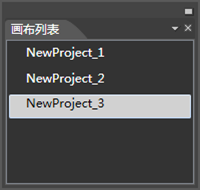
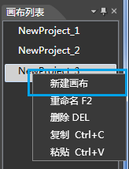
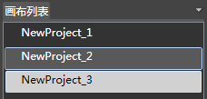
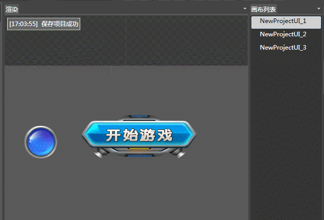

## 画布列表面板

### 简介

1. 对项目中的画布进行管理。
2. 多画布主要是保存和显示不同渲染区的内容。

### 功能

#### 新建画布

1. 使用画布列表中的右键菜单，可以新建多个空白画布。

2. 同一工程内，画布尺寸的是全部一致的。

#### 画布切换

1. 同一工程可以进行多个画布之间的流畅切换。

2. 资源文件可以在多个画布中复用。

#### 画布间控件拷贝

支持将一个画布上的内容拷贝到其他画布中。

### 右键菜单

#### 新建画布

使用画布列表中的右键菜单，新建多个画布，新建画布名称为默认名称（项目名称+&ldquo;_&rdquo;+序号）。

#### 重命名

重命名：画布名称不能为空，不能和已存在的画布重名，不能为不能有下列符号：&quot;？&quot;、&quot;、&quot;、&quot;╲&quot;、&quot;*&quot;、&quot;&quot;&quot;、&quot;&quot;&quot;、&quot;&lt;&quot;、&quot;&gt;&quot;、&quot;|&quot;；快捷键F2。

#### 删除

删除：将选中画布删除，当仅有一个画布时，不能进行删除操作，最少要有一个画布；快捷键 Delete。

此删除将无法恢复，删除时会有确认提示。

#### 复制

将选中画布进行拷贝，快捷键 Ctrl +C。

#### 粘贴

将选中画布进行粘贴，快捷键 Ctrl +V。

Copyright © 2013 [CocoStudio.org](http://www.cocostudio.org ""). All Rights Reserved. 版本:1.4.0.0
