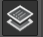
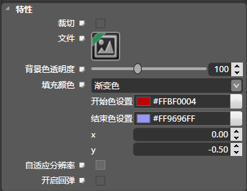

## 列表层[UIListView]

### 图标

### 描述

UIListView的类是一个UIWidget子类，它实现了在触摸屏上的列表层。

触摸一个滚动层时拦截事件和动作消息发送到目标对象时。设定的目标和行动方法都继承自UIWidget。该控件提供了方法来设置滚动层的裁切，显示区域宽高，滚动区域宽高，背景色透明度，填充颜色，图片资源等属性。

### 尺寸和模式

控件布局用于控制控件的位置、大小、缩放等信息，布局的属性区在不同的布局模式下会显示不同的设置选项。 

该选项统一由父节点来设置。 

包括：绝对布局模式、相对布局模式、横向线性布局模式、纵向线性布局模式。 

####  绝对布局模式 

#####  百分比 

设置是否开启百分比模式 。 

#####  坐标 

设置控件的位置，单位为像素。 

* X：设置控件的坐标X值
* Y：设置控件的坐标Y值

#####  比例（%） 

设置控件的位置，值相对于父控件尺寸的百分比。 

#####  缩放 

设置控件的缩放比例，分为X轴缩放和Y轴缩放。值可以为正，也可以为负值，当为负值时可以实现翻转效果 

#####  旋转 

设置控件的旋转属性，属性值为该控件以锚点为中心顺时针旋转的度数。 

可以通过拖拽蓝色操作点控制旋转读书，控件的旋转方向和蓝色点相对中心点的方向一致。 

####  相对布局模式 

#####  停靠 

设置控件的停靠对象，默认为父控件，还可以选择和控件本身没有布局关系的同级控件。 

*  停靠父对象
  1.  横向对齐：设置控件水平方向上的对齐方式，依次为&ldquo;左边&rdquo;、&ldquo;居中&rdquo;、&ldquo;右边&rdquo;。
  2.  纵向对齐：设置控件竖直方向上的对齐方式，依次为&ldquo;上边&rdquo;、&ldquo;居中&rdquo;、&ldquo;下边&rdquo;。

*   停靠同级对象
  1.  横向对齐：设置控件水平方向上的对齐方式，依次为&ldquo;左边&rdquo;、&ldquo;居中&rdquo;、&ldquo;右边&rdquo;。
  2.  纵向对齐：设置控件竖直方向上的对齐方式，依次为&ldquo;上边&rdquo;、&ldquo;居中&rdquo;、&ldquo;下边&rdquo;。

#####  边缘 

设置控件相对于停靠位置的距离。单位为像素。 

#####  缩放 

设置控件的缩放比例，分为X轴缩放和Y轴缩放。值可以为正，也可以为负值，当为负值时可以实现翻转效果 

#####  旋转 

设置控件的旋转属性，属性值为该控件以锚点为中心顺时针旋转的度数。 

可以通过拖拽蓝色操作点控制旋转读书，控件的旋转方向和蓝色点相对中心点的方向一致。 

####  线性横向布局模式 

#####  纵向布局 

设置控件竖直方向上的对齐方式，依次为&ldquo;上边&rdquo;、&ldquo;居中&rdquo;、&ldquo;下边&rdquo;。（仅在停靠边界为&rdquo;左&ldquo;或者&rdquo;右&ldquo;时可以使用） 

#####  边缘 

设置控件相对于停靠位置的位移。单位为像素。 

注意：值只在特定的情况下设置 

#####  缩放 

设置控件的缩放比例，分为X轴缩放和Y轴缩放。值可以为正，也可以为负值，当为负值时可以实现翻转效果 

#####  旋转 

设置控件的旋转属性，属性值为该控件以锚点为中心顺时针旋转的度数。 

可以通过拖拽蓝色操作点控制旋转读书，控件的旋转方向和蓝色点相对中心点的方向一致。 

####  线性纵向布局模式 

#####  横向布局 

设置控件水平方向上的对齐方式，依次为&ldquo;左边&rdquo;、&ldquo;居中&rdquo;、&ldquo;右边&rdquo;。（仅在停靠边界为&rdquo;上&ldquo;或者&rdquo;下&ldquo;时可以使用） 

#####  边缘 

设置控件相对于停靠位置的位移。单位为像素。 

注意：值只在特定的情况下设置 

#####  缩放 

设置控件的缩放比例，分为X轴缩放和Y轴缩放。值可以为正，也可以为负值，当为负值时可以实现翻转效果 

#####  旋转 

设置控件的旋转属性，属性值为该控件以锚点为中心顺时针旋转的度数。 

可以通过拖拽蓝色操作点控制旋转读书，控件的旋转方向和蓝色点相对中心点的方向一致。 

### 子控件布局

#### 子控件间隔

设置子控件间的间隔，该值为子控件滑动方向上的相邻控件间隔。

#### 子控件布局

##### 滑动方向

设置子控件的滑动方向，同时子控件也会按照

##### 排列

设置子控件的停靠位置。

*   横向排列：若滑动方向为Vertical则显示该选项，可选值为HOEIZONTAL_LEFT（向左停靠）、HOEIZONTAL_RIGHT（向右停靠）、HOEIZONTAL_CENTER（横向停靠）
*   纵向排列：若滑动方向为Vertical则显示该选项，可选值为VERTICAL_TOP（向上停靠）、VERTICAL_BOTTOM（向下停靠）、VERTICAL_CENTER（居中停靠）

### 尺寸和模式

请查看[尺寸和模式](3-3-16UIEditor-General-Property.md)

### 常规属性

#### 交互

控制控件是否接受用户事件，如果该控件需要接受用户事件（如按钮），则需勾选。

#### Tag

设置控件的Tag，程序中可以通过该Tag值获取该控件。

#### 名字

设置控件的名称，程序中可以通过该名称获取该控件。

#### 渲染层级

设置控件渲染的先后顺序。值越小越先渲染，但是可能会被后渲染的覆盖。

#### 透明度

设置控件的透明度。取值范围为0到255。0 为纯透明，255为不透明。

#### 颜色混合

此属性设置控件的混合颜色。点击下拉菜单后会出现颜色选择框，选择颜色后会将原控件与该颜色进行混合渲染。

### 控件布局

控件布局用于控制控件的位置、大小、缩放等信息，布局的属性区在不同的布局模式下会显示不同的设置选项。 

该选项统一由父节点来设置。 

包括：绝对布局模式、相对布局模式、横向线性布局模式、纵向线性布局模式。 

####  绝对布局模式 

#####  百分比 

设置是否开启百分比模式 。 

#####  坐标 

设置控件的位置，单位为像素。 

*   X：设置控件的坐标X值
*   Y：设置控件的坐标Y值

#####  比例（%） 

设置控件的位置，值相对于父控件尺寸的百分比。 

#####  缩放 

设置控件的缩放比例，分为X轴缩放和Y轴缩放。值可以为正，也可以为负值，当为负值时可以实现翻转效果 

#####  旋转 

设置控件的旋转属性，属性值为该控件以锚点为中心顺时针旋转的度数。 

可以通过拖拽蓝色操作点控制旋转读书，控件的旋转方向和蓝色点相对中心点的方向一致。 

####  相对布局模式 

#####  停靠 

设置控件的停靠对象，默认为父控件，还可以选择和控件本身没有布局关系的同级控件。 

*  停靠父对象

  1.  横向对齐：设置控件水平方向上的对齐方式，依次为&ldquo;左边&rdquo;、&ldquo;居中&rdquo;、&ldquo;右边&rdquo;。
  2.  纵向对齐：设置控件竖直方向上的对齐方式，依次为&ldquo;上边&rdquo;、&ldquo;居中&rdquo;、&ldquo;下边&rdquo;。

*   停靠同级对象
  1.  横向对齐：设置控件水平方向上的对齐方式，依次为&ldquo;左边&rdquo;、&ldquo;居中&rdquo;、&ldquo;右边&rdquo;。
  2.  纵向对齐：设置控件竖直方向上的对齐方式，依次为&ldquo;上边&rdquo;、&ldquo;居中&rdquo;、&ldquo;下边&rdquo;。
&nbsp;

#####  边缘 

设置控件相对于停靠位置的距离。单位为像素。 

#####  缩放 

设置控件的缩放比例，分为X轴缩放和Y轴缩放。值可以为正，也可以为负值，当为负值时可以实现翻转效果 

#####  旋转 

设置控件的旋转属性，属性值为该控件以锚点为中心顺时针旋转的度数。 

可以通过拖拽蓝色操作点控制旋转读书，控件的旋转方向和蓝色点相对中心点的方向一致。 

####  线性横向布局模式 

#####  纵向布局 

设置控件竖直方向上的对齐方式，依次为&ldquo;上边&rdquo;、&ldquo;居中&rdquo;、&ldquo;下边&rdquo;。（仅在停靠边界为&rdquo;左&ldquo;或者&rdquo;右&ldquo;时可以使用） 

#####  边缘 

设置控件相对于停靠位置的位移。单位为像素。 

注意：值只在特定的情况下设置 

#####  缩放 

设置控件的缩放比例，分为X轴缩放和Y轴缩放。值可以为正，也可以为负值，当为负值时可以实现翻转效果 

#####  旋转 

设置控件的旋转属性，属性值为该控件以锚点为中心顺时针旋转的度数。 

可以通过拖拽蓝色操作点控制旋转读书，控件的旋转方向和蓝色点相对中心点的方向一致。 

####  线性纵向布局模式 

#####  横向布局 

设置控件水平方向上的对齐方式，依次为&ldquo;左边&rdquo;、&ldquo;居中&rdquo;、&ldquo;右边&rdquo;。（仅在停靠边界为&rdquo;上&ldquo;或者&rdquo;下&ldquo;时可以使用） 

#####  边缘 

设置控件相对于停靠位置的位移。单位为像素。 

注意：值只在特定的情况下设置 

#####  缩放 

设置控件的缩放比例，分为X轴缩放和Y轴缩放。值可以为正，也可以为负值，当为负值时可以实现翻转效果 

#####  旋转 

设置控件的旋转属性，属性值为该控件以锚点为中心顺时针旋转的度数。 

可以通过拖拽蓝色操作点控制旋转读书，控件的旋转方向和蓝色点相对中心点的方向一致。 

### 特性

#### 模拟裁剪

隐藏掉控件显示区域外的子控件。

#### 文件

配置一张默认下的图片（png,jpg），控件默认状态下显示。

#### 滚动区域宽度

设置滚动区域的宽度。

注意：滚动区域宽高设置后渲染区会有一个绿色的线框与之对应，需要滚动的子控件都必须包涵在绿色线框内才能进行滚动。

#### 滚动区域高度

设置滚动区域的高度。

#### 背景色透明度

1. 设置背景颜色的透明度，范围0-255。 0表示完全透明，255表示不透明。

#### 填充颜色

##### 无颜色

无颜色状态下，控件背景色变成无

##### 单色

设置背景色的颜色（RGB）

##### 渐变色

1.  开始色

设置渐变色的起点颜色

2.  结束色

设置渐变色的结束颜色

3.  X

向量x

4.  Y
向量y

#### 开启回弹

设置拖拽层是否开启回弹效果。若开启，拖拽层的内容将能够被拖动至脱离拖拽层边界。

Copyright © 2013 [CocoStudio.org](http://www.cocostudio.org ""). All Rights Reserved. 版本:1.4.0.0
