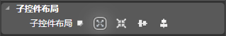
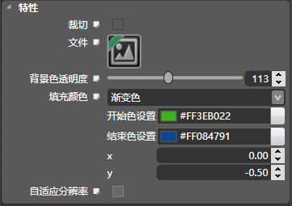

## 层容器[UIPanel]

### 图标

### 描述

UIPanel的类是一个UIWidget子类，它实现了在触摸屏上的层容器。

触摸一个层容器时拦截事件和动作消息发送到目标对象时。设定的目标和行动方法都继承自UIWidget。该控件提供了方法来设置层容器的裁切，宽高，背景色透明度，填充颜色，图片资源等属性。

### 子控件布局

子控件布局是针对层容器的子控件来设置的属性。

默认值为绝对布局，但绝对布局是简单的、简陋的布局方式，在不同分辨率的屏幕中效果会比较差，推荐根据布局实际情况选择子控件布局方式。

### 尺寸和模式

#### 尺寸

*  W：设置控件的宽，单位为像素（px）。
*  H：设置控件的高，单位为像素（px）。

#### 百分比

开启控件的百分比模式。该设置项仅在Custom模式先显示。

#### 比例

*  W：设置控件的宽，该值为控件的父控件的宽相对百分比。
*  H：设置控件的高，该值为控件的父控件的高相对百分比。

#### 九宫格

九宫格是利用一张很小的图片来绘制大区域图片却不失真的技术。

绘制时会遵循下面的规则：

a. 保持4个角部分不变形

b. 单向拉伸4条边（即在4个角两两之间的边，比如上边，只做横向拉伸）

c. 双向拉伸中间部分（即九宫格的中间部分，横向，纵向同时拉伸，PS：拉伸比例不一定相同）

CocoStudio共四个参数：

"原点X"、"原点Y"&nbsp;是一对参数，它可以确定我们中心区域的左下角的坐标（左下角为原点）；

"尺寸W"、"尺寸H"则确定中心区域的大小；

注意 ：

控件宽要大于2\*X、控件高要大于2\*Y，否则容易出现贴图错位现象。

设置九宫格属性后应将缩放属性值都设置为1，否则图片仍然会出现失真。

### 常规属性

#### 交互

控制控件是否接受用户事件，如果该控件需要接受用户事件（如按钮），则需勾选。

#### Tag

设置控件的Tag，程序中可以通过该Tag值获取该控件。

#### 名字

设置控件的名称，程序中可以通过该名称获取该控件。

#### 渲染层级

设置控件渲染的先后顺序。值越小越先渲染，但是可能会被后渲染的覆盖。

#### 透明度

设置控件的透明度。取值范围为0到255。0 为纯透明，255为不透明。

#### 颜色混合

此属性设置控件的混合颜色。点击下拉菜单后会出现颜色选择框，选择颜色后会将原控件与该颜色进行混合渲染。

### 控件布局

控件布局用于控制控件的位置、大小、缩放等信息，布局的属性区在不同的布局模式下会显示不同的设置选项。

该选项统一由父节点来设置。

包括：绝对布局模式、相对布局模式、横向线性布局模式、纵向线性布局模式。

#### 绝对布局模式

##### 百分比

设置是否开启百分比模式 。

##### 坐标

设置控件的位置，单位为像素。

*  X：设置控件的坐标X值
*  Y：设置控件的坐标Y值

##### 比例（%）

设置控件的位置，值相对于父控件尺寸的百分比。

##### 缩放

设置控件的缩放比例，分为X轴缩放和Y轴缩放。值可以为正，也可以为负值，当为负值时可以实现翻转效果

##### 旋转

设置控件的旋转属性，属性值为该控件以锚点为中心顺时针旋转的度数。

可以通过拖拽蓝色操作点控制旋转读书，控件的旋转方向和蓝色点相对中心点的方向一致。

#### 相对布局模式

##### 停靠

设置控件的停靠对象，默认为父控件，还可以选择和控件本身没有布局关系的同级控件。

*  停靠父对象
 1.  横向对齐：设置控件水平方向上的对齐方式，依次为&ldquo;左边&rdquo;、&ldquo;居中&rdquo;、&ldquo;右边&rdquo;。
 2.  纵向对齐：设置控件竖直方向上的对齐方式，依次为&ldquo;上边&rdquo;、&ldquo;居中&rdquo;、&ldquo;下边&rdquo;。

##### 边缘

设置控件相对于停靠位置的距离。单位为像素。

#####  缩放

设置控件的缩放比例，分为X轴缩放和Y轴缩放。值可以为正，也可以为负值，当为负值时可以实现翻转效果

##### 旋转

设置控件的旋转属性，属性值为该控件以锚点为中心顺时针旋转的度数。

可以通过拖拽蓝色操作点控制旋转读书，控件的旋转方向和蓝色点相对中心点的方向一致。

#### 线性横向布局模式

##### 纵向布局

设置控件竖直方向上的对齐方式，依次为&ldquo;上边&rdquo;、&ldquo;居中&rdquo;、&ldquo;下边&rdquo;。（仅在停靠边界为&rdquo;左&ldquo;或者&rdquo;右&ldquo;时可以使用）

##### 边缘

设置控件相对于停靠位置的位移。单位为像素。

注意：值只在特定的情况下设置

##### 缩放

设置控件的缩放比例，分为X轴缩放和Y轴缩放。值可以为正，也可以为负值，当为负值时可以实现翻转效果

##### 旋转

设置控件的旋转属性，属性值为该控件以锚点为中心顺时针旋转的度数。

可以通过拖拽蓝色操作点控制旋转读书，控件的旋转方向和蓝色点相对中心点的方向一致。

#### 线性纵向布局模式

##### 横向布局

设置控件水平方向上的对齐方式，依次为&ldquo;左边&rdquo;、&ldquo;居中&rdquo;、&ldquo;右边&rdquo;。（仅在停靠边界为&rdquo;上&ldquo;或者&rdquo;下&ldquo;时可以使用）

##### 边缘

设置控件相对于停靠位置的位移。单位为像素。

注意：值只在特定的情况下设置

##### 缩放

设置控件的缩放比例，分为X轴缩放和Y轴缩放。值可以为正，也可以为负值，当为负值时可以实现翻转效果

##### 旋转

设置控件的旋转属性，属性值为该控件以锚点为中心顺时针旋转的度数。

可以通过拖拽蓝色操作点控制旋转读书，控件的旋转方向和蓝色点相对中心点的方向一致。

### 特性

 
#### 裁剪

隐藏掉控件显示区域外的子控件

#### 文件

配置一张默认状态下的图片（支持png,jpg格式）。

#### 背景色透明度

设置背景颜色的透明度，范围0-255。 0表示完全透明，255表示不透明。

#### 填充颜色

##### 无颜色

无颜色状态下，控件背景色变成无

##### 单色

设置背景色的颜色（RGB）

##### 渐变色

1. 开始色  
设置渐变色的起点颜色     
2. 结束色  
设置渐变色的结束颜色
3.  X  
向量x
4.  Y  
向量y

Copyright © 2013 [CocoStudio.org](http://www.cocostudio.org ""). All Rights Reserved. 版本:1.4.0.0
