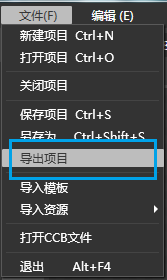
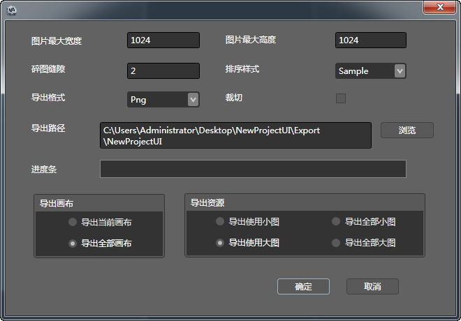

## 项目使用

### 导出

1.  选择**菜单**栏->**导出项目**

2.  设置导出目录及其他选项

3.  点击确认，完成导出。

### 复制文件

将导出目录中的文件全部复制到项目的Resources文件夹中

### 使用

将导出后的项目放到资源文件件中。（假设画布名称为“UIEditorTest_1”）

`//根据文件创建一个界面 `  
`TouchGroup* ul =TouchGroup::create(); `   
`ul->addWidget(GUIReader::shareReader()->widgetFromJsonFile("UIEditorTest_1.json"));  `
 
`//根据tag获取一个控件`  
`ul->getChildByTag(1);`

`//播放UI动画`  
`AnimationManager::shareManager()->getAnimationByName("DemoHead_UI.json","Animation0")->play();`

Copyright © 2013 [CocoStudio.org](http://www.cocostudio.org ""). All Rights Reserved. 版本:1.4.0.0
