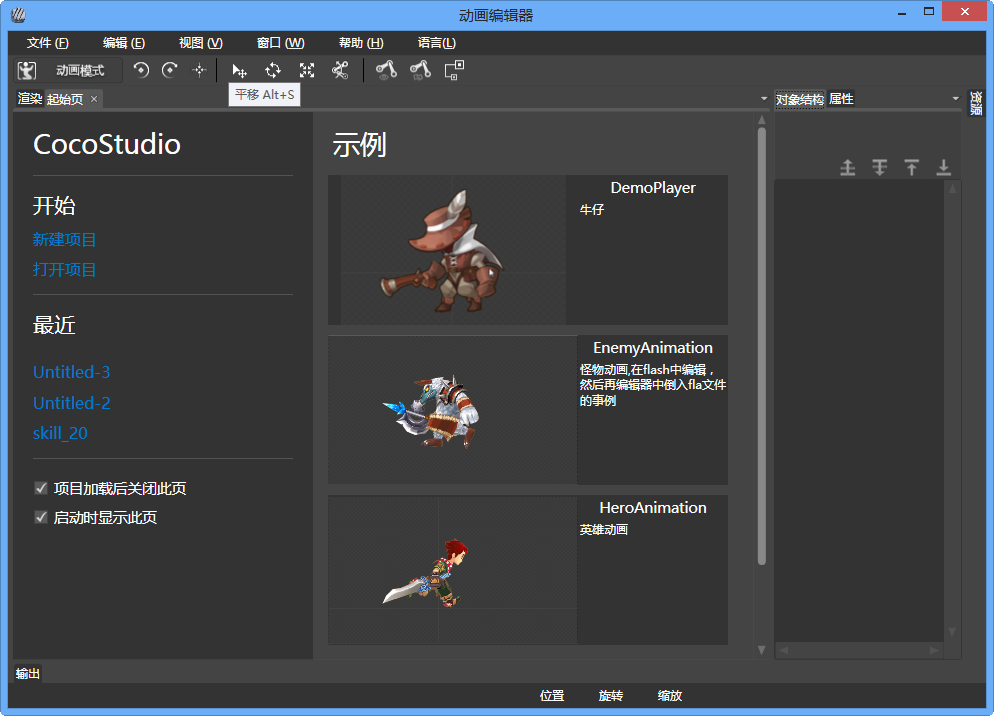

## Animation 编辑器简介

### 概述

Animation编辑器支持主流的骨骼动画、序列帧动画的制作与编辑，也支持DragoneBones、Flash动画直接导入。 

### 工作区

*   [渲染面板](4-2-2AnimationEditor-Panel-Render.md)
*   [资源管理面板](4-2-3AnimationEditor-Panel-ResourceManger.md)
*   [属性面板](4-2-4AnimationEditor-Panel-Properties.md)
*   [资源面板](4-2-5AnimationEditor-Panel-Resource.md)
*   [动作列表面板](4-2-6AnimationEditor-Panel-AnimationList.md)
*   [对象关系面板](4-2-7AnimationEditor-Panel-ObjectStructure.md)
*   [动画帧面板](4-2-8AnimationEditor-Panel-AnimationFrame.md)
*   [输出面板](4-2-9AnimationEditor-Panel-Output.md)
*   [预览面板](4-2-10AnimationEditor-Panel-Preview.md)
*   [菜单栏](4-2-11AnimationEditor-Panel-Menu.md)
*   [快捷工具面板](4-2-12AnimationEditor-Panel-ExpressTools.md)

### 常用操作

点击查看动作[编辑器常用操作](4-3AnimationEditor-Common-Operations.md)。 

### 骨骼属性

点击查看[骨骼属性](4-4AnimationEditor-General-Property.md)。 

### 项目导出

点击查看[导出Animation工程](4-5AnimationEditor-Export.md)。 

### 使用项目

点击查看[如何使用Animation工程](4-6AnimationEditor-Use-Project.md)。 

Copyright © 2013 [CocoStudio.org](http://www.cocostudio.org ""). All Rights Reserved. 版本:1.4.0.0
