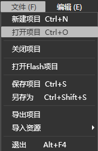
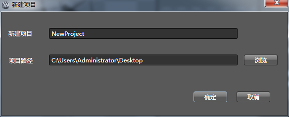
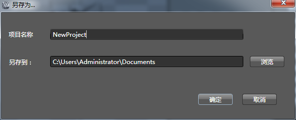
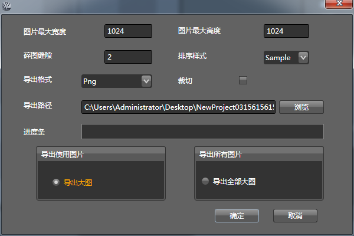
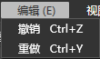
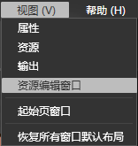
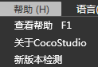

## 菜单栏

### 简介

菜单栏是编辑器常用操作的集合。主要分为文件，编辑，视图，帮助四大类对编辑器进行整体的操作。

### 功能

#### 文件(Alt+F)

##### 新建项目(Ctrl+N)

创建一个新的Animation项目，如果当前有打开的项目，软件会提示是否保存当前项目。新建项目时需要设置项目名称和项目路径。 

注意：

1：创建项目名称中不能有下列符号："？"、"、"、"╲"、"*"、"""、"""、"<"、">"、"|"。项目名称尽量不要使用中文。

2：XP系统下请不要将项目创建在桌面上，其他路径均可

3：最好不要把工程建在系统安全目录下。

##### 打开项目(Ctrl+O)

打开已有的项目。

##### 保存项目(Ctrl+S)

对当前正在编辑的项目进行保存操作。 

##### 另存为(Ctrl+Shift+S)

将当前项目另存为一个新的项目。

##### 导出项目

将选中的画布导出为程序中可以使用的资源。详情请查看[Animation项目导出](4-5AnimationEditor-Export.md)。

##### 导入资源

导入文件 

1.选择磁盘中的文件进行导入，支持多选择导入。            	 

2.遇到同名文件时会提示同名，导入失败。

导入文件夹 

1.选择磁盘中的文件夹进行导入。

2.遇到同名文件夹时会提示同名，导入失败。

##### 退出(Alt+F4)

关闭编辑器。若有已修改项目，软件会提示用户保存项目。 

#### 编辑(Alt+E)

##### 撤销

撤销上一步操作。

##### 重做

将撤销的操作恢复。

#### 视图（ALT+V）

##### 隐藏/显示标尺

切换渲染面板的标尺显示状态。

##### 清除参考线

将渲染面板中的参考线移除。

##### 锁定参考线

将渲染面板中的参考线锁定，锁定后的参考将不可移动。

##### 新建参考线

创建一个新的参考线。

提示：可以通过拖拽标尺的方式快速创建参考线。

#### 窗口（ALT+W）

##### 属性

打开属性窗口。

##### 资源

打开资源窗口。

##### 输出

打开输出窗口。

##### 资源编辑窗口

打开资源编辑窗口。

##### 恢复所有窗口默认布局

将编辑器的窗口布局恢复到初始布局。

#### 帮助(Alt+H)

##### 查看帮助(F1)

查看在线帮助文档。

##### 关于Cocostudio

打开cocostudio信息窗口。

##### 新版本检测

检查是否有新版本，进行版本升级。

#### 语言(Alt+L)

##### English

设置编辑器语言为英文版，重启编辑器后生效。

##### 中文

设置编辑器语言为中文版，重启编辑器后生效。

Copyright © 2013 [CocoStudio.org](http://www.cocostudio.org ""). All Rights Reserved. 版本:1.4.0.0
