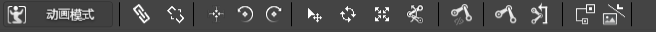
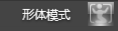
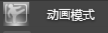
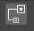
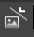

## 快捷工具面板

### 简介

### 功能

#### 形体/动画模式开关

 &nbsp;&nbsp;&nbsp;&nbsp;&nbsp;

切换形体模式和动画模式。

#### 连续绑定骨骼

将所选控件逆时针旋转90度。

#### 移除骨骼关系

将所选控件逆时针旋转90度。

#### 中心点对齐

将所选控件（需选择多个控件）中心点对齐。

#### 逆时针旋转90度

将所选控件逆时针旋转90度。

#### 顺时针旋转90度

将所选控件顺时针旋转90度。

#### 旋转骨骼模式

在渲染区对骨骼操作时是旋转操作。

#### 平移模式

在渲染区对骨骼操作时是移动操作。

#### 旋转模式

在渲染区对骨骼操作时是旋转操作。

#### 缩放模式

在渲染区对骨骼操作时是缩放操作。

#### 反向动力学

在渲染区对骨骼的操作时反向动力模式。

#### 显示骨骼模式

选中时显示骨骼，非选择状态则不显示骨骼。

#### 创建骨骼模式

选中时可以创建骨骼，非选择状态则不可以创建骨骼。该开关仅在形体模式下出现。

#### 连续创建子骨骼模式

选中时可以创建骨骼，非选择状态则不可以创建骨骼。该开关仅在形体模式下出现。

#### 查看骨骼关系

打开骨骼关系查看面板。

#### 资源编辑器

打开资源编辑窗口。

Copyright © 2013 [CocoStudio.org](http://www.cocostudio.org ""). All Rights Reserved. 版本:1.4.0.0
