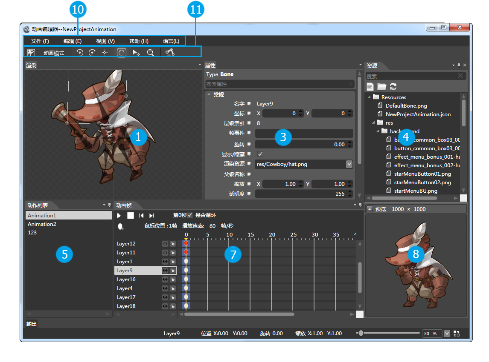
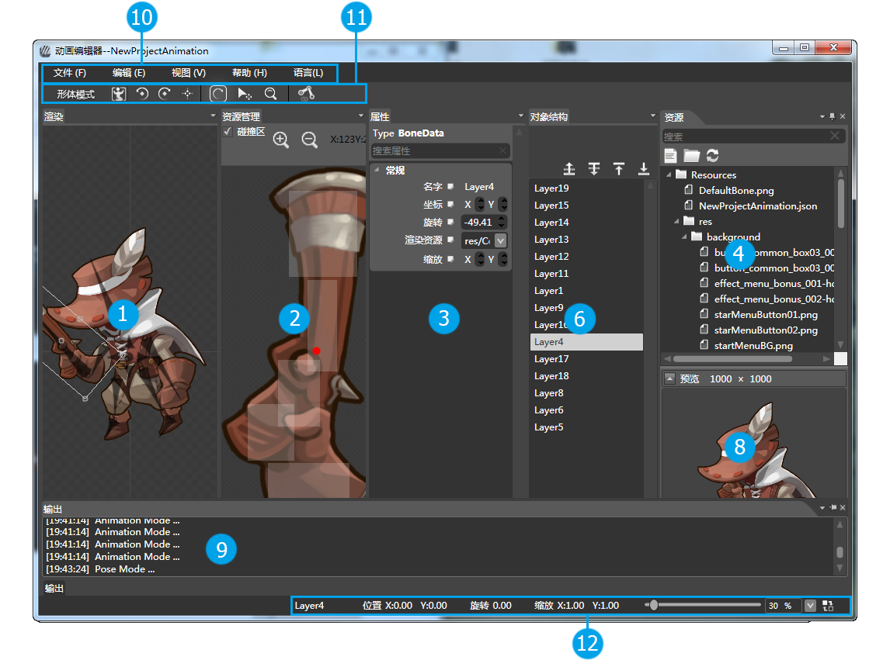

## Animation Editor 工作区

### 工作区

<table width="366"border="1" cellspacing="0" cellpadding="0" >
		  <tr>
		    <td width="35" height="43" align="center"></td>
		    <td width="315"><a href="4-2-2AnimationEditor-Panel-Render.md">渲染面板</a></td>
	      </tr>
		  <tr>
		    <td height="42" align="center"></td>
		    <td><a href="4-2-3AnimationEditor-Panel-ResourceManger.md">资源管理器面板</a></td>
	      </tr>
		  <tr>
		    <td height="39" align="center"></td>
		    <td><a href="4-2-4AnimationEditor-Panel-Properties.md">属性面板</a></td>
	      </tr>
		  <tr>
		    <td height="37" align="center"></td>
		    <td><a href="4-2-5AnimationEditor-Panel-Resource.md">资源面板</a></td>
	      </tr>
		  <tr>
		    <td height="41" align="center"></td>
		    <td><a href="4-2-6AnimationEditor-Panel-AnimationList.md">动作列表面板</a></td>
	      </tr>
		  <tr>
		    <td height="35" align="center"></td>
		    <td><a href="4-2-7AnimationEditor-Panel-ObjectStructure.md">对象关系面板</a></td>
	      </tr>
		  <tr>
		    <td height="32" align="center"></td>
		    <td><a href="4-2-8AnimationEditor-Panel-AnimationFrame.md">动画帧面板</a></td>
	      </tr>
		  <tr>
		    <td height="35" align="center"></td>
		    <td><a href="4-2-10AnimationEditor-Panel-Preview.md">预览面板</a></td>
	      </tr>
           <tr>
		    <td height="32" align="center"></td>
		    <td><a href="4-2-9AnimationEditor-Panel-Output.md">输出面板</a></td>
	      </tr>
		  <tr>
		    <td height="35" align="center"></td>
		    <td><a href="4-2-11AnimationEditor-Panel-Menu.md">菜单栏</a></td>
	      </tr>
           <tr>
		    <td height="32" align="center"></td>
		    <td><a href="4-2-12AnimationEditor-Panel-ExpressTools.md">快捷选项面板</a></td>
	      </tr>
</table>

Copyright © 2013 [CocoStudio.org](http://www.cocostudio.org ""). All Rights Reserved. 版本:1.4.0.0
