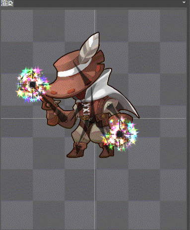
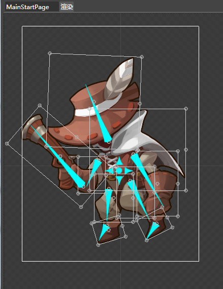
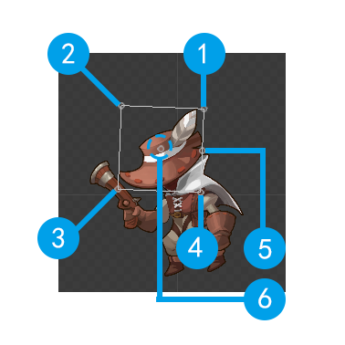
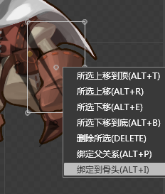

## 渲染面板

### 简介

渲染窗口提供一个绘制骨骼动画的面板，提供实时的效果预览。

### 功能

#### 框选

使用鼠标框选控件，对整体或单个骨骼进行调整操作。

#### 调整骨骼 / 贴图

说明： 

*   1，2，4，5处可以通过鼠标调整控件的大小，对控件进行伸缩操作；
*   3处可以对控件进行旋转操作；
*   6处为锚点

### 右键菜单

#### 所选上移到顶

将所选骨骼或贴图移动到图层的最顶端。最顶端的图像可以覆盖其他位于它之下的骨骼或贴图。

#### 所选上移

将所选骨骼或贴图向上移动一个图层。

#### 所选下移

将所选骨骼或贴图向下移动一个图层。

#### 所选下移到顶

将所选骨骼或贴图向下移动一个图层。

#### 删除所选

将所选骨骼或贴图删除。

#### 绑定父关系

为所选骨骼选择父骨骼。该选项仅对尚未绑定父骨骼的骨骼有效。

#### 解除父关系

为所选骨骼解除父子关系绑定。该选项仅对已绑定的骨骼有效。

#### 绑定到骨头

为所选贴图绑定骨骼。该选项仅对未绑定骨骼的贴图有效。

Copyright © 2013 [CocoStudio.org](http://www.cocostudio.org ""). All Rights Reserved. 版本:1.4.0.0
