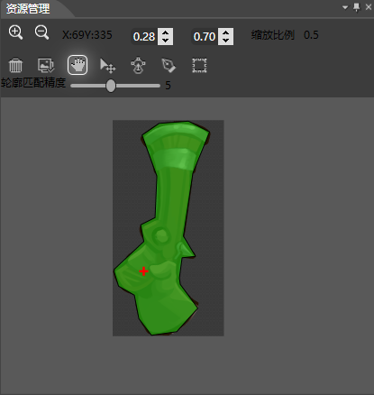
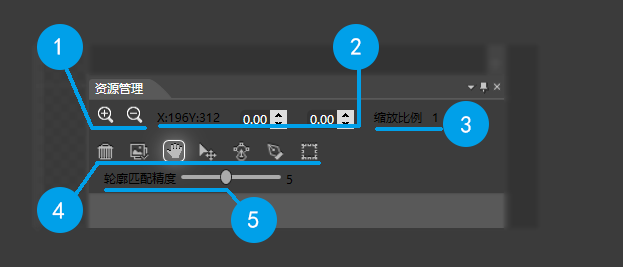

## 资源管理面板

### 简介

资源编辑窗口中可以编辑选中骨骼的当前使用资源的碰撞区和锚点信息

### 功能

#### 放大

加号按钮用来控制资源画布的放大操作。

#### 缩小

减号按钮用来控制资源画布的缩小操作。

#### 锚点位置

显示锚点的位置。

#### 设置锚点

设置锚点的位置，值为贴图的大小的百分比。

#### 缩放系数

显示当前资源管理面板的缩放系数。 

#### 清除所有轮廓

清除资源管理面板上的所有碰撞区轮廓。

#### 图像匹配

根据图像的边缘自动绘制图像的碰撞区。

#### 轮廓移动

移动被选中的碰撞区。

#### 修改轮廓

在修改轮廓模式下，碰撞区轮廓呈可编辑状态，您可以通过拖拽定点的位置来修改轮廓。

#### 绘制轮廓

您可以通过鼠标绘制一个自动封闭的任意形状碰撞区。当您开始点击时绘制开始，松开鼠标结束

注意：

最终的碰撞区将会被转化为Cocos2d-x可以识别的多边形。

#### 钢笔工具

您可以通过鼠标点击连线生成一个任意形状的多边形碰撞区。您每在资源管理面板上点击一次，屏幕上将会记录一个关键点。当您再次点击第一个关键点的时候结束编辑，并按照这些点的顺序绘制一个多边形。

当您再次点击关键点（不包括第一个关键点）的时候，该关键点将会被移除。

注意：

您必须手动的闭合碰撞区的绘制。在闭合之前，您所绘制的都不会被保存记录。

#### 方形工具

方形工具是一个绘制简单碰撞区的方法，您在资源管理上点击屏幕将会开始绘制矩形的起始点，松开后结束绘制。              

#### 轮廓匹配精确度

设置轮廓匹配精确度。范围从1到10。值越小越精确。

修改该值只针对下一次的轮廓匹配有效。

### 右键菜单

#### 删除轮廓

删除选中的碰撞区。

Copyright © 2013 [CocoStudio.org](http://www.cocostudio.org ""). All Rights Reserved. 版本:1.4.0.0
