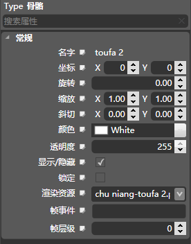
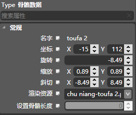
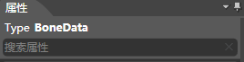
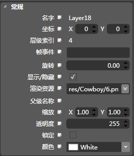

## 属性面板

### 简介

&nbsp;&nbsp;&nbsp; 

属性面板暂时当前选中的骨骼或者贴图的属性，在形体模式下和动画模式下显示的属性会稍有不同，动画模式下（左图）会比形体模式下（右图）更丰富一些，但是两者是同步的，形体模式下那些属性仅仅是被隐藏而非没有。

### 功能

#### 搜索

1.顶部描述的当前选中的控件。

2.搜索：根据用户的输入进行特点属性的匹配查看。

#### 通用属性

请查看[骨骼/贴图通用属性页](4-4AnimationEditor-General-Property.md)。

#### 重置属性

鼠标右键点击属性名称，将会弹出&ldquo;Reset to Defaults&rdquo;提示框。点击提示框将重置该属性为默认值。

注意：部分属性不提供重置功能，且提示框呈灰色不可点击的状态。 

Copyright © 2013 [CocoStudio.org](http://www.cocostudio.org ""). All Rights Reserved. 版本:1.4.0.0
