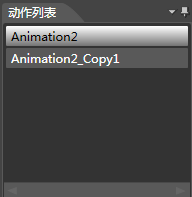
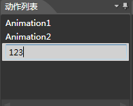
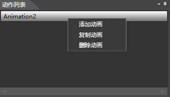

## 动作列表面板

### 简介

该面板提供对项目中的动作管理。

### 功能

#### 修改动画名称

现在想要修改名称的动作，F2键开启修改动画名称状态。

### 右键菜单

#### 添加动画

在当前位置添加一个新的动画。

#### 复制动画

将当前选中动画复制一份到列表的末尾。

#### 删除动画

删除当前选中动画。

Copyright © 2013 [CocoStudio.org](http://www.cocostudio.org ""). All Rights Reserved. 版本:1.4.0.0
