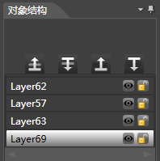
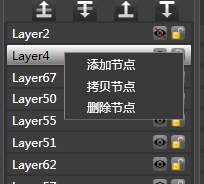

## 对象结构面板

### 简介

对象结构窗口显示了当前骨骼动画的所有层信息。

窗口支持隐藏层，锁定层，改变层zorder，重命名层等操作。

### 功能

#### 显示/隐藏

1.点击结构树上的&quot;小眼睛&quot;图标 设置控件的显示隐藏。

2.这里的显示隐藏与属性区的显示/隐藏是同步的，都可用于设置控件的Visible属性。

#### 锁定/解锁

1.点击结构树上的&quot;小铜锁&quot;图标 设置控件的锁定/解锁。

2.控件锁定后将会屏蔽锁定控件的所有操作。

#### 层级调整

调整层级zorder会改变此层级的显示顺序，在对象结构窗口调整zorder会影响到所有的帧的zorder。zorder大的层级在上，所有最上层的层级zorder最大。可以单选或多选调整层级。

<table cellspacing="0" cellpadding="0" border="1">
           
                <tr>
                  <td ></td>
                  <td width="302">将当前节点向上移动一层</td>
                </tr>
                <tr>
                  <td></td>
                  <td>将当前节点向下移动一层</td>
                </tr>
                <tr>
                  <td></td>
                  <td>将当前节点最顶层</td>
                </tr>
                <tr>
                  <td></td>
                  <td>将当前节点最底层</td>
                </tr>
</table>

#### 创建序列帧动画

可以在资源窗口中选中一个或者多个资源后按住鼠标左键拖到此层级上，层级会在当前动作中自动创建相应数目的帧，每一帧对应的显示对象为相应的资源，每一帧间隔为5帧。

#### 多选层级

1.选中一个层级，按住shift键，再选一个层级

2.按住ctrl键选择多个层级

3.按住ctrl+a选择所有层级

### 右键菜单

#### 添加节点

在当前位置添加一个新的节点。        

#### 拷贝节点

拷贝当前节点到节点列表的末尾。

#### 删除节点

将当前节点删除。          

Copyright © 2013 [CocoStudio.org](http://www.cocostudio.org ""). All Rights Reserved. 版本:1.4.0.0
