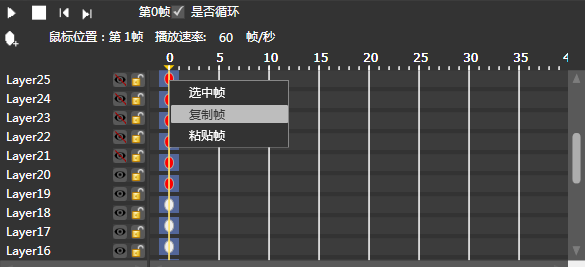

## 渲染面板

### 简介

动画帧区域显示了当前动画所具有的所有帧信息。任何动作的选择与设置都需要在这个面板中操作完成。

您可以选择特定时间点上的某一个层，并针对这个层来设置位置、移动效果等。

### 功能

#### 帧操作

##### 添加帧：

1.如右图所示：右键添加关键帧就会在鼠标位置创建一个灰色的椭圆作为关键帧的标记。                

2.也可以通过左上角的添加关键帧按钮进行添加。

##### 删除帧：

如上图所示：右键删除帧就会删除当前选中的关键帧，即删除当前选中的椭圆标记。

##### 移动帧：

选中关键帧的椭圆标记经过鼠标拖拽可以移动你想要的位置

#### 动画播放

<table border="1" cellspacing="0" cellpadding="0">
             
                <tr>
                  <td>播放动画：点击将开始播放当前选择动画。</td>
                </tr>
              <tr>
                  <td >停止动画：停止当前播放动画</td>
                </tr>
              
                <tr>
                  <td >添加关键帧：鼠标选中需要添加关键帧的位置，点击将添加一个关键帧。</td>
                </tr>
              
                <tr>
                  <td >循环动画：勾选将循环播放动画</td>
                </tr>
               
                <tr>
                  <td >播放速率：可以通过设置帧率来控制动画运行的快慢。默认值为60帧/秒 。</td>
                </tr>
               
                <tr>
                  <td >鼠标位置：显示鼠标放置在第几帧便于用户精确添加关键帧。 </td>
                </tr>
</table>

#### 镜像参考

镜像参考是一项编辑辅助功能，它能够给您提供一个指定的或者相邻的帧所具有动作状态，以协助您更好的编辑当前帧的人物状态。

<table border="1" cellspacing="0" cellpadding="0">
                <tr>
                  <td>开启镜像参考模式：选择是否开启镜像参考，勾选时为开启状态。</td>
                </tr>
              <tr>
                  <td >前[]帧：设置选中帧之前的镜像帧数量，镜像颜色为红色（离当前帧越远，颜色越淡）。中间的数字可以自行设置，默认值为0。</td>
                </tr>
              
                <tr>
                  <td >后[]帧：显示当前选中帧之后数帧的镜像，镜像颜色为蓝色（离当前帧越远，颜色越淡）。中间的数字可以自行设置，默认值为0。</td>
                </tr>
              
                <tr>
                  <td >添加到当前帧：将选中帧的镜像添加到渲染区，镜像颜色为绿色。添加后该帧将会在帧的时间轴上显示一个黄色方块。</td>
                </tr>
</table>

#### 缓动

&ldquo;缓动&rdquo;是指动画过程中的渐进加速或减速，它会使您的动画看起来更逼真、更自然。目前编辑器提供了30中默认缓动类型。另外提供自定义缓动曲线编辑功能，您可以按照自己的需求来编辑缓动曲线。

自定义

自定义曲线是通过选择两个关键点绘制的_贝塞尔曲线_(B&eacute;zier curve)。有关_贝塞尔曲线_(B&eacute;zier curve)的内容您可以在[wikipedia](http://zh.wikipedia.org/wiki/%E8%B2%9D%E8%8C%B2%E6%9B%B2%E7%B7%9A#.E4.BA.8C.E6.AC.A1.E6.9B.B2.E7.B7.9A)上了解更详细的内容。

预设

cocostudio一共预设了30种缓动类型，你可以挑选一种作为该帧区间的缓动类型。默认为line，即无缓动。

### 右键菜单

<table cellpadding="0" cellspacing="0" border="1">
    	  <tr>
    	    <td width="100">选项</td>
    	    <td width="307">描述</td>
   	      </tr>
    	  <tr>
    	    <td width="48">添加帧</td>

    	    <td width="226">在当前刻度对所有选择的层级添加一帧</td>
   	      </tr>
    	  <tr>
    	    <td>删除帧</td>

    	    <td>删除所有已经选中的关键帧</td>
   	      </tr>
    	  <tr>
    	    <td>隐藏帧</td>

    	    <td>隐藏所有已经选中的关键帧</td>
   	      </tr>
    	  <tr>
    	    <td>显示帧</td>

    	    <td>显示所有被选中且隐藏的关键帧</td>
   	      </tr>
		   <tr>
    	    <td>隐藏补间帧</td>

    	    <td>隐藏当前帧区间的补间帧</td>
   	      </tr>
    	  <tr>
    	    <td>显示补间帧</td>

    	    <td>显示当前帧区间的补间帧</td>
   	      </tr>
    	  <tr>
    	    <td>复制帧</td>

    	    <td>复制所有已经选中的关键帧</td>
   	      </tr>
    	  <tr>
    	    <td>粘贴帧</td>

    	    <td>粘贴所有已经复制的帧</td>
   	      </tr>
    	  <tr>
    	    <td>选中帧</td>

    	    <td>选中当前点击的关键帧</td>
   	      </tr>
    	  <tr>
    	    <td>取消选中</td>

    	    <td>取消选中当前点击的关键帧</td>
   	      </tr>
		  <tr>
    	    <td>添加缓动帧</td>
    	    <td>为当前帧区间设置缓动帧类型、默认为Linear</td>
   	      </tr>
 </table>

Copyright © 2013 [CocoStudio.org](http://www.cocostudio.org ""). All Rights Reserved. 版本:1.4.0.0
