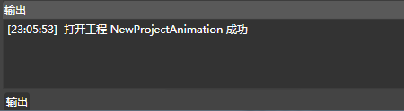

## 输出面板

### 简介

1.对用户的部分操作进行输出显示

### 功能

#### 记录

 

对用户的部分操作进行输出显示

### 右键菜单

#### 清除

清除当前的输出列表的内容。

Copyright © 2013 [CocoStudio.org](http://www.cocostudio.org ""). All Rights Reserved. 版本:1.4.0.0
