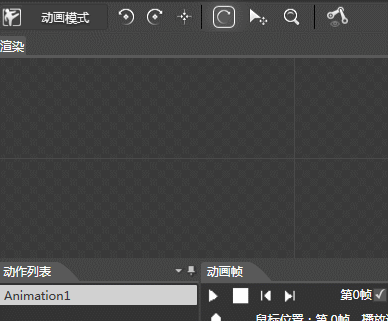
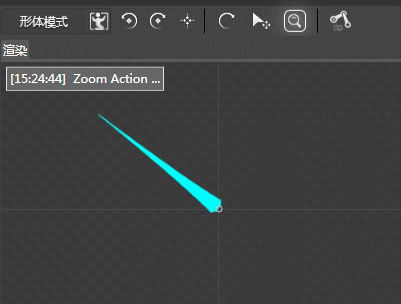
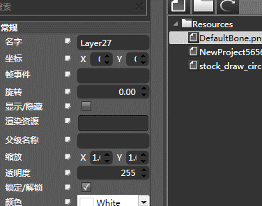
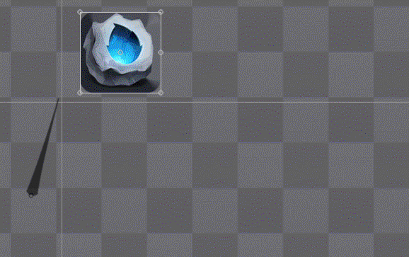
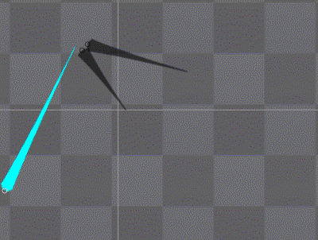
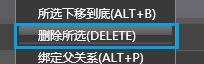
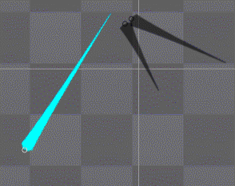

## 动作编辑器常用操作

### 创建骨骼

#### 动画示例

#### 所需模式

1.  形体模式
2.  创建骨骼
 
#### 步骤

1：在渲染区点击鼠标左键开始绘制骨骼。

2：松开鼠标完成绘制。如绘制过短将会显示一个锚点。

### 修改骨骼

#### 动画示例

#### 所需模式

1.  形体模式
2.  停止创建骨骼

#### 操作

##### 调整骨骼的方向

点击快捷工具中的旋转按钮，拖拽需要调整的骨骼即可调整骨骼的方向

##### 调整轴心位置

点击快捷工具中的平移按钮，拖拽需要调整的骨骼即可调整骨骼的位置。

##### 调整骨骼的长度

点击快捷工具中的放大按钮，拖拽需要调整的骨骼即可调整骨骼的长度。

### 添加贴图

#### 动画示例

#### 所需模式

1.  形体模式
2.  停止创建骨骼

#### 步骤

方法A:1：选中骨骼，直接从资源面板中拖拽图片至属性面板的渲染资源属性框中。

方法B:1：从资源面板中拖拽贴图至渲染面板中。

注意：方法A会直接绑定好骨骼，不可更改

### 绑定到骨头

#### 动画示例

#### 所需模式

1.  形体模式
2.  停止创建骨骼

#### 步骤

1：在渲染面板中选中贴图，选择右键菜单&quot;绑定到骨头ALT+F&quot;。

2：在渲染面板中选择需要绑定到的骨骼。

3：软件提示&quot;图片将被绑定到骨头上，是否继续&quot;，选择&quot;是&quot;。

### 绑定父关系

#### 动画示例

#### 所需模式

1.  形体模式
2.  停止创建骨骼

#### 步骤

1：在渲染面板中选中将要作为子级的骨骼。

2：选择右键菜单&quot;绑定父关系（ALT+P）&quot;。

3：选择将要作为父级的骨骼。

注意：同一个骨骼只有一个父级骨骼，但可以有多个子级。

### 删除所选

#### 动画示例

#### 所需模式

1.  形体模式
2.  停止创建骨骼

#### 步骤

1：在渲染面板中选择即将删除的骨骼。

2：选择右键菜单&quot;删除所选（DELETE）&quot;即可将对象删除。

注意：删除时会连带删除所有子级，若只想删除当前骨骼，需要解除父关系。

### 解除父关系

#### 动画示例

&nbsp;

#### 所需模式

1.  形体模式
2.  停止创建骨骼

#### 步骤

1：在渲染面板中选择即将删除的骨骼。

2：选择右键菜单&quot;解除父关系（ALT+D）&quot;即可解除骨骼绑定关系。

Copyright © 2013 [CocoStudio.org](http://www.cocostudio.org ""). All Rights Reserved. 版本:1.4.0.0
