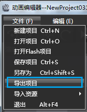
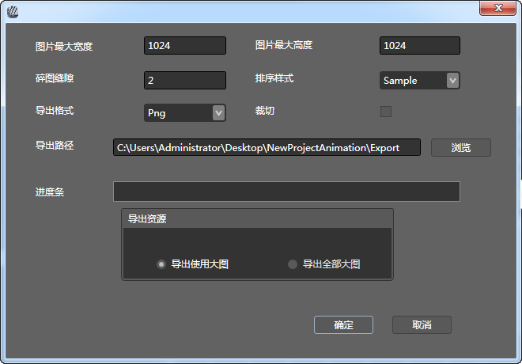

## 项目使用

### 导出

1.  选择**菜单**栏->**导出项目**

2.  设置导出目录

3.  点击确认并完成

### 复制文件

将导出目录中的文件全部复制到项目的Resources文件夹中。

### 使用

将导出后的项目放到资源文件中。

`//从导出文件异步加载动画`  
`CCArmatureDataManager::sharedArmatureDataManager()->addArmatureFileInfo("Cowboy0.png","Cowboy0.plist","Cowboy.ExportJson");`

`//根据动画名称创建动画精灵`  
`CCArmature *armature = CCArmature::create("Cowboy");`

`//播放指定动作`  
`armature->getAnimation()->playByIndex(0);`

`//修改属性`  
`armature->setScale(0.5f);`  

`//设置动画精灵位置`  
`armature->setPosition(200,300);`

`//添加到当前页面`  
`this->addChild(armature,2);`

Copyright © 2013 [CocoStudio.org](http://www.cocostudio.org ""). All Rights Reserved. 版本:1.4.0.0
