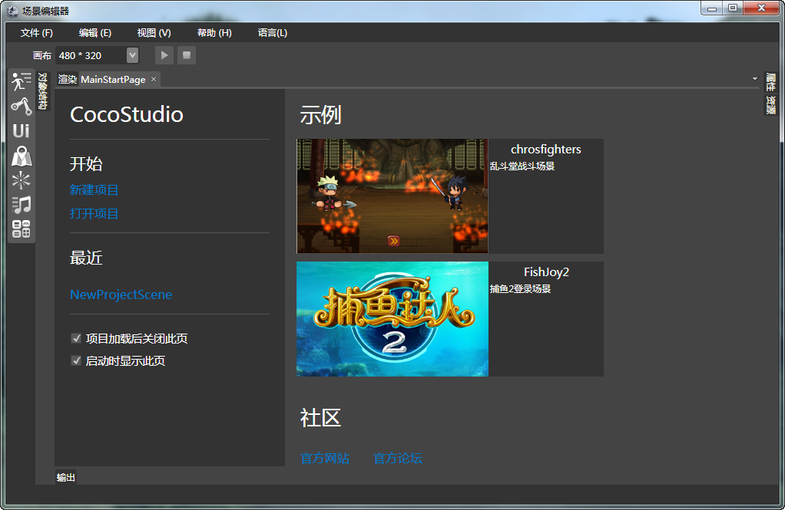

## Scene Editor简介

### 概述

Scene编辑器可以整合我们CocoStudio其他编辑器的资源，并将其处理成一个游戏场景。

### 工作区

*   [渲染面板](5-2-2SceneEditor-Panel-Render.md)
*   [对象结构面板](5-2-3SceneEditor-Panel-ObjectStructure.md)
*   [属性面板](5-2-4SceneEditor-Panel-Properties.md)
*   [资源面板](5-2-5SceneEditor-Panel-Resource.md)
*   [输出面板](5-2-6SceneEditor-Panel-Output.md)
*   [组件面板](5-2-7SceneEditor-Panel-Component.md)
*   [预览面板](5-2-8SceneEditor-Panel-Preview.md)
*   [菜单栏](5-2-9SceneEditor-Panel-Menu.md)
*   [快捷工具面板](5-2-10SceneEditor-Panel-ExpressTools.md)
*   [状态栏](5-2-11SceneEditor-Panel-StatusBar.md)
*   [设备连接](5-2-12SceneEditor-Panel-ConnectDevice.md)
*   [模拟器选择](5-2-13SceneEditor-Panel-SimulatorSelector.md)
*   [触发器](5-2-14SceneEditor-Panel-Trigger.md)

### 组件

*   [精灵组件](5-3-2SceneEditor-Component-Spirit.md)
*   [地图组件](5-3-3SceneEditor-Component-Map.md)
*   [例子组件](5-3-4SceneEditor-Component-particle.md)
*   [动画组件](5-3-5SceneEditor-Component-Armature.md)
*   [声音组件](5-3-6SceneEditor-Component-ComAudio.md)
*   [UI组件](5-3-7SceneEditor-Component-GUIComponent.md)
*   [自定义属性组件](5-3-8SceneEditor-Component-ComAttribute.md)

### 导出项目

[点此查看：如何导出UI工程项目](3-4UIEditor-Export.md)

### 在项目中使用

[点此查看：如何使用UI工程](3-5UIEditor-Use-Project.md)

Copyright © 2013 [CocoStudio.org](http://www.cocostudio.org ""). All Rights Reserved. 版本:1.4.0.0
