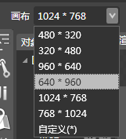
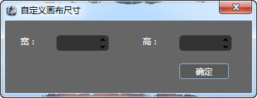
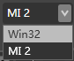
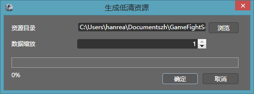

## 快捷工具面板

### 简介

### 功能

#### 画布

&nbsp;&nbsp;&nbsp;&nbsp;&nbsp;&nbsp;&nbsp;&nbsp;&nbsp;&nbsp; 

1.选择画布的尺寸              

2.支持自定义画布尺寸

#### 播放

启动场景模拟器，播放当前场景。

#### 停止

关闭场景模拟器

#### 设备列表

当前已和编辑器连接的移动设备列表以及编辑器自带的"win32"模拟器。

#### 链接设备

打开设备链接窗口。

#### 触发器

打开触发器编辑窗口。

#### 资源高清转低清

转换现有资源为低清资源。

Copyright © 2013 [CocoStudio.org](http://www.cocostudio.org ""). All Rights Reserved. 版本:1.4.0.0
