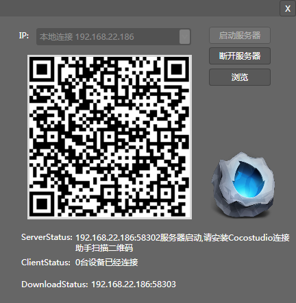

## 链接设备

### 简介

CocoStudio 1.1版本以后新加入了移动设备的调试支持。你可以在真实的环境中查看场景编辑器中的所有内容。

### 功能

#### 选择IP

选择作为服务器的IP地址。

注意：如果你的计算机拥有多个网卡，您必须选择与一个能和移动设备链接同一个内部网络的网卡。

#### 开启服务

开启供移动设备链接的服务进程。并初始化二维码图片

#### 停止服务

关闭远程链接的服务端，关闭后移动设备将无法从场景编辑器中获取数据。

#### 刷新

刷新服务器端的数据包。如果你在场景编辑器中做了修改，你必须刷新后才能使移动设备获取编辑后的数据。

#### 浏览

打开移动设备端安装包所在的文件夹。安卓设备可直接安装，IOS设备需要越狱。

Copyright © 2013 [CocoStudio.org](http://www.cocostudio.org ""). All Rights Reserved. 版本:1.4.0.0
