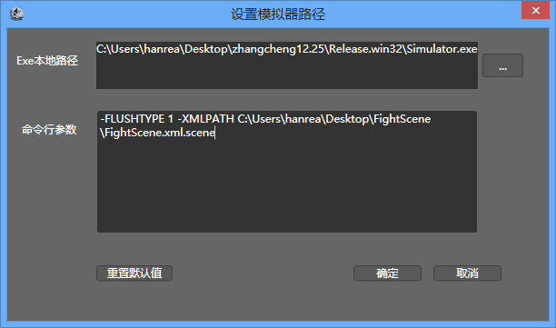

## 模拟器选择    

### 简介

CocoStudio1.2.0.0版本开始提供模拟器的选择，你可以根据自己的需求选择需要的模拟器。

### 功能

#### Exe本地路径

选择模拟器的可执行文件的文件路径。默认为CocoStudio自带的模拟器路径地址。        

CocoStudio的模拟器源码已经发布到Github.com平台上，您可以通过修改程序来实现自己的模拟器，添加及修改自己所需要的功能。

#### 命令行参数

传递给模拟器的参数。这个参数包含当前项目的路径信息，用于引导模拟器读取场景数据。

这个参数默认是不需要修改的，但是如果您自定义了自己的模拟器，您可以根据您的模拟器要求来填写此参数。

#### 重置默认值

将&ldquo;Exe本地路径&rdquo;和&ldquo;命令行参数&rdquo;重置为系统默认值。

Copyright © 2013 [CocoStudio.org](http://www.cocostudio.org ""). All Rights Reserved. 版本:1.4.0.0
