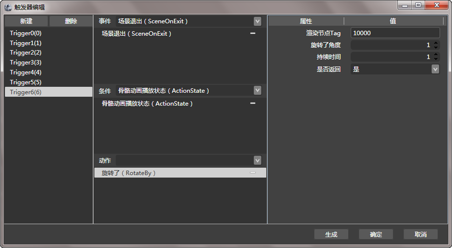

## 触发器

### 简介

CocoStudio 1.2.0.0版本在场景编辑器中新加入了触发器功能。

触发器是一种通过事件触发机制，在特定的事件被触发的时候自动执行自己预先定义的动作或者功能。

### 功能

#### 新建触发器

点击&ldquo;触发器&rdquo;，将会弹出&ldquo;新建触发器&rdquo;选项。新建立的触发默认会以阿拉伯数字顺序命名。

#### 事件

选择触发当前触发器的触发条件。

事件默认包含8种条件，分别是SceneOnEnter、SceneOnExit、SceneInit、SceneUpdate；TouchBegan、TouchMoved、TouchEnded、TouchCancelled。除了这些默认事件，您也可以根据您的需要定义自己的事件。

根据要求修改$User\Documents\CocoStudio\Samples\Trigger\Trigger\Event.xml文件，即可扩展自己的事件。其中&ldquo;ClassName&rdquo;属性表示在程序中的方法名，&ldquo;Name&rdquo;属性是在编辑器中显示的事件名称。

#### 条件

条件是用来判断触发当前事件时是否执行预订的动作。只有当条件成立的时候才会继续执行预订的动作。

当不包含任何条件的时候，动作会被直接触发。

当包含多个条件的时候，条件之间的关系为并，只有当所有的条件都是符合的时候才能够执行预订的动作。

编辑器默认提供了TimeElapsedTo、ActionState、IsNodeInRect、IsNodeVisible四种条件，除了这些默认条件，您也可以根据您的需要定义自己的事件。更具要求修改$User\Documents\CocoStudio\Samples\Trigger\Trigger\Condition.xml文件，即可扩展自己的事件。其中&ldquo;ClassName&rdquo;属性表示在程序中的方法名，&ldquo;Name&rdquo;属性是在编辑器中显示的条件名称。

#### 动作

动作是当触发当前触发器且条件都成立的情况下进行的游戏变化操作。

编辑器默认提供了PlayMusic、MoveTo、MoveBy、RotateTo、RotateBy、	ScaleTo、ScaleBy、SkewTo、SkewBy、TriggerState、ArmaturePlayAction12种默认动作。

除了这些默认事件，您也可以根据您的需要定义自己的事件。更具要求修改$User\Documents\CocoStudio\Samples\Trigger\Trigger\Event.xml文件，即可扩展自己的事件。其中&ldquo;ClassName&rdquo;属性表示在程序中的方法名，&ldquo;Name&rdquo;属性是在编辑器中显示的动作名称。

#### 属性

为条件或动作所定义的属性。

#### 生成

根据当前触发器配置生成代码文件，您可以将这些代码文件直接加入您的项目工程。

生成的文件位置位于当前项目文件夹下的&ldquo;Code&rdquo;目录。

#### 确定

保存当前触发器配置。

#### 取消

结束触发器配置。新修改的配置将会被丢失。

Copyright © 2013 [CocoStudio.org](http://www.cocostudio.org ""). All Rights Reserved. 版本:1.4.0.0
