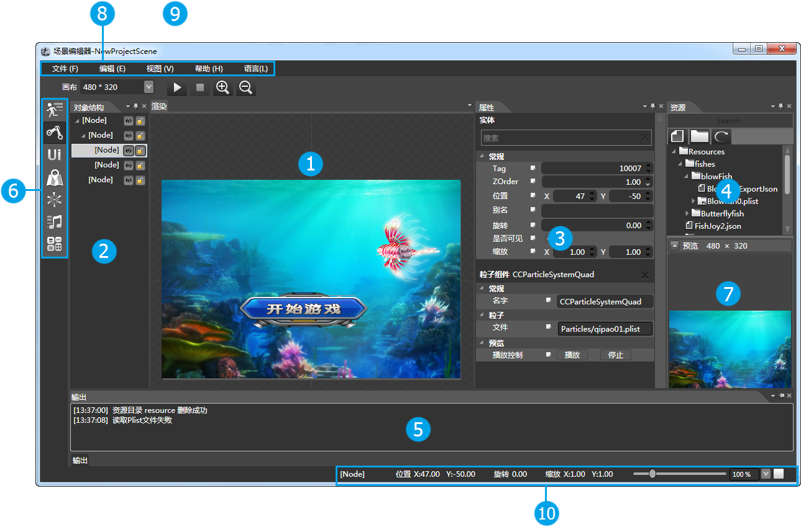

## Scene Editor 窗口管理

### 对象结构窗口

<table width="366" border="1" cellspacing="0" cellpadding="0" >
		  <tr>
		    <td width="35" height="43" align="center"></td>
		    <td width="315"><a href="5-2-2SceneEditor-Panel-Render.html">渲染面板</a></td>
	      </tr>
		  <tr>
		    <td height="42" align="center"></td>
		    <td><a href="5-2-3SceneEditor-Panel-ObjectStructure.html">对象结构面板</a></td>
	      </tr>
		  <tr>
		    <td height="39" align="center"></td>
		    <td><a href="5-2-4SceneEditor-Panel-Properties.html">属性面板</a></td>
	      </tr>
		  <tr>
		    <td height="37" align="center"></td>
		    <td><a href="5-2-5SceneEditor-Panel-Resource.html">资源面板</a></td>
	      </tr>
		  <tr>
		    <td height="41" align="center"></td>
		    <td><a href="5-2-6SceneEditor-Panel-Output.html">输出面板</a></td>
	      </tr>
		  <tr>
		    <td height="35" align="center"></td>
		    <td><a href="5-2-7SceneEditor-Panel-Component.html">组件面板</a></td>
	      </tr>
		  <tr>
		    <td height="32" align="center"></td>
		    <td><a href="5-2-8SceneEditor-Panel-Preview.html">预览面板</a></td>
	      </tr>
		  <tr>
		    <td height="35" align="center"></td>
		    <td><a href="5-2-9SceneEditor-Panel-Menu.html">菜单栏</a></td>
	      </tr>
           <tr>
		    <td height="32" align="center"></td>
		    <td><a href="5-2-10SceneEditor-Panel-ExpressTools.html">快捷工具面板</a></td>
	      </tr>
		   <tr>
		    <td height="32" align="center"></td>
		    <td><a href="5-2-11SceneEditor-Panel-StatusBar.html">状态栏</a></td>
	      </tr>
		    <tr>
		    <td height="32" align="center"></td>
		    <td><a href="5-2-12SceneEditor-Panel-ConnectDevice.html">设备连接</a></td>
	      </tr>
		    <tr>
		    <td height="32" align="center"></td>
		    <td><a href="5-2-13SceneEditor-Panel-SimulatorSelector.html">模拟器选择</a></td>
	      </tr>
		   <tr>
		    <td height="32" align="center"></td>
		    <td><a href="5-2-14SceneEditor-Panel-Trigger.html">触发器</a></td>
	      </tr>
</table>

Copyright © 2013 [CocoStudio.org](http://www.cocostudio.org ""). All Rights Reserved. 版本:1.4.0.0
