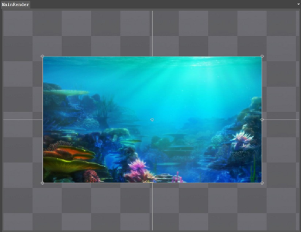
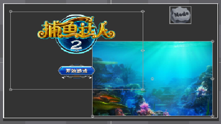
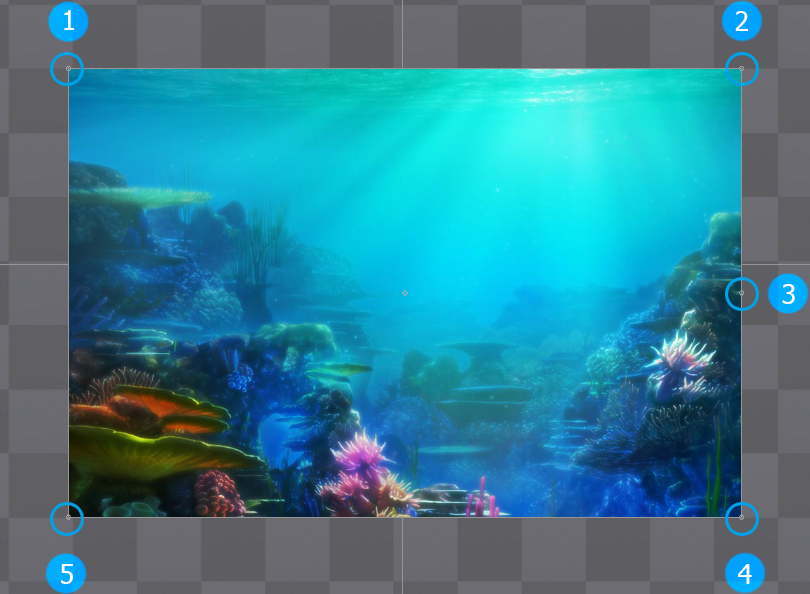
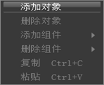
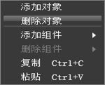
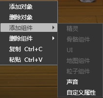
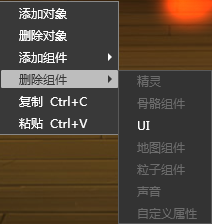
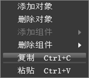
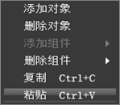

## 渲染面板

### 简介

渲染窗口提供一个绘制控件的面板，提供实时的效果预览。

### 功能

#### 框选

用鼠标框选控件，对控件进行整体的复制，删除等操作和设置。

#### 调整视图

说明：

 1.   1，2，4，5处可以通过鼠标调整组件的大小，对控件进行伸缩操作（按住Shift时为等比缩放）；

 2.   3处可以对控件进行旋转操作；

注意：只有挂载了精灵组件、ui组件、地图组件的Node才有以上功能。

### 右键菜单

#### 添加对象

在画布中添加一个对象。

选中已经存在的场景对象右键添加对象时是添加到当前选中的对象上作为它的子集,若没有选中任何控件则添加在根对象上作为子集。       

#### 删除对象

删除选中对象

  
1.若没选中对象或者仅选中一个对象，该菜单项被屏蔽

2.如果选中对象包含子集，会把连同子集一起删除。 

#### 添加组件

<table cellspacing="0" cellpadding="0" border="1">
          <tr>
            <td width="75">骨骼组件</td>
            <td width="346">骨骼动画组件包含了渲染骨骼动画的功能，挂载骨骼动画组件之后，空对象变成了一个动画对象。（骨骼动画是由Cocostudio动画编辑器制作导出）</td>
          </tr>
          <tr>
            <td>地图组件</td>
            <td>地图组件包含了渲染tmx格式地图文件的功能，挂载地图组件之后，空对象变成了地图对象。</td>
          </tr>
          <tr>
            <td>UI</td>
            <td>ui组件包含了渲染ui控件的功能，挂载ui组件后，空对象变成一个ui对象。</td>
          </tr>
          <tr>
            <td>粒子组件</td>
            <td>粒子组件包含了渲染pliat格式粒子文件的功能，挂载粒子组件之后，空对象变成了粒子对象。</td>
          </tr>
          <tr>
            <td>自定义属性</td>
            <td>自定义属性组件包含了加载数据json文件的功能，挂载自定义属性组件后，空对象变成了一个有逻辑属性的对象。</td>
          </tr>
          <tr>
            <td>声音</td>
            <td>音效组件包含了播放mp3和wav格式音效的功能，挂载音效组件后，空对象变成了一个音效对象。</td>
          </tr>
          <tr>
            <td>精灵</td>
            <td>精灵组件包含了渲染png图片的功能，挂接精灵组件之后，空对象变成了一个png对象。</td>
          </tr>
</table>

  
1.注意一个空对象只能挂接一个渲染组件，渲染组件包括骨骼组件、地图组件、ui组件、粒子组件、精灵组件，这些组件只要有一个被挂载到对象，其他的会自动灰掉。

2.一个空对象只能添加一个音效组件和一个自定义组件。

#### 删除组件

        
<table cellspacing="0" cellpadding="0" border="1">
          <tr>
            <td width="86">骨骼组件</td>
            <td width="238">去掉骨骼动画功能</td>
          </tr>
          <tr>
            <td>地图组件</td>
            <td>去掉地图组件功能</td>
          </tr>
          <tr>
            <td>UI</td>
            <td>去掉UI功能</td>
          </tr>
          <tr>
            <td>粒子组件</td>
            <td>去掉粒子组件</td>
          </tr>
          <tr>
            <td>自定义属性</td>
            <td>去掉自定义属性组件</td>
          </tr>
          <tr>
            <td>声音</td>
            <td>去掉声音组件</td>
          </tr>
          <tr>
            <td>精灵</td>
            <td>去掉精灵组件</td>
          </tr>
</table>

选中节点不包含的组件，则该组件对应的菜单项被屏蔽 。

#### 复制

 

  
1.若没选中对象，该菜单项被屏蔽

2.支持多选复制，快捷键Ctrl+C。

#### 粘贴

  
1.若没被拷贝的对象，该菜单项被屏蔽。

2.鼠标右键粘贴时粘贴位置根据鼠标位置变化而变化。

3.快捷键Ctrl+V粘贴时，位置为当前复制对象的位置。

Copyright © 2013 [CocoStudio.org](http://www.cocostudio.org ""). All Rights Reserved. 版本:1.4.0.0
