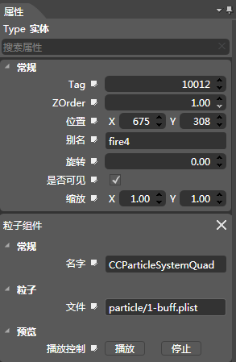
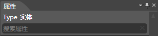
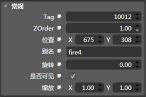

## 属性面板

### 简介

1.当选中一个对象，属性窗口会显示出该对象的所有属性。

2.修改任意属性可以立即改变该节点在渲染区域的状态

### 功能

#### 搜索

1.顶部描述的当前选中的对象。

2.搜索：根据用户输入文本筛选出匹配的属性。

#### 通用属性

<table cellspacing="0" cellpadding="0" border="1">
              <col width="216" />
              <col width="467" />
              <col width="491" />
              <tr>
                <td width="53">Tag</td>
                <td width="411" colspan="3">用于代码查找Node的标识（默认新添加一个Node，Tag自动加1）。</td>
              </tr>
              <tr>
                <td>ZOrder</td>
                <td colspan="3">调整Node的渲染顺序，上下的遮挡关系。</td>
              </tr>
              <tr>
                <td>位置</td>
                <td colspan="3">调整控件的坐标。</td>
              </tr>
              <tr>
                <td>别名</td>
                <td colspan="3">给Node起一个别名，在对象结构面板显示。</td>
              </tr>
              <tr>
                <td>旋转</td>
                <td colspan="3">调整控件的旋转角度。</td>
              </tr>
              <tr>
                <td>是否可见</td>
                <td colspan="3">是否显示Node以及其子集</td>
              </tr>
              <tr>
                <td>缩放：</td>
                <td colspan="3">调整控件的横向缩放和纵向缩放；</td>
              </tr>
</table>

#### 组件属性

请查看[组件列表](5-3-1SceneEditor-Component.md)。

#### 重置属性

鼠标右键点击属性名称，将会弹出&ldquo;Reset to Defaults&rdquo;提示框。点击提示框将重置该属性为默认值。

注意：部分属性不提供重置功能，且提示框呈灰色不可点击的状态。 

Copyright © 2013 [CocoStudio.org](http://www.cocostudio.org ""). All Rights Reserved. 版本:1.4.0.0
