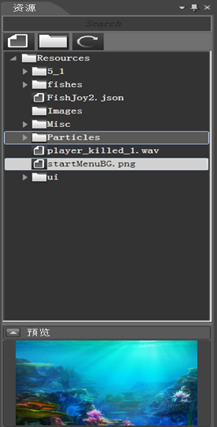
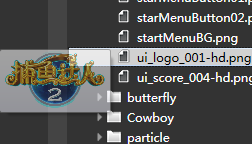
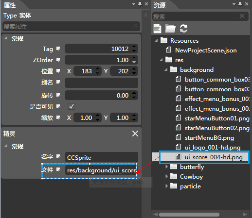

## 资源面板

### 简介

资源窗口：

1.对项目所用的资源进行管理。

2.主要是辅助渲染区进行资源引用。

### 功能

#### 添加文件

1.选择磁盘中的文件进行导入，支持多选择导入。

2.最好不要导入同名文件，编辑器会有提示，同名文件将无法导入。

#### 添加文件夹

 1.选择磁盘中的文件夹进行导入，

 2.最好不要导入同名文件夹，编辑器会有提示，同名文件夹将无法导入。

#### 刷新资源

 1.当用户手动删除或添加Resource文件夹下的资源文件时，用于同步刷新到资源列表。

#### 搜索

根据用户的输入文本筛选出文件名匹配的资源

#### 预览资源

&nbsp;&nbsp;&nbsp;&nbsp; 

1.点击资源，将在预览面板中显示图像。

2.鼠标悬浮在资源名称上将悬浮出一个窗口提供图像预览。

3.双击可以打开系统的图片查看器进行预览。

#### 拖拽进行资源配置

 

如图将资源区的.png文件拖拽至控件属性区的文件属性框中就完成了控件的文件属性的配置

### 右键菜单

#### 在资源管理器中打开

使用window系统的文件管理器打开选中的文件

#### 重命名

1.对资源进行重命名，Plist和PSD图像文件不支持不能重命名。

2.会有非法字符限制。

3.快捷键F2。

#### 删除

1.将选中的文件删除。

该操作会同时删除磁盘中的文件。

#### 导入

##### 导入文件

1.选择磁盘中的文件进行导入，支持多选择导入。            	 

2.遇到同名文件时会提示同名，导入失败。 

##### 导入文件夹

1.选择磁盘中的文件夹进行导入

2.遇到同名文件夹时会提示同名，导入失败； 

#### 导出碎图

将Plist 、 PSD图片分割成小图后导出 。

#### 刷新资源列表

当用户手动删除或添加Resource文件夹下的资源文件时，用于同步刷新到资源列表 

Copyright © 2013 [CocoStudio.org](http://www.cocostudio.org ""). All Rights Reserved. 版本:1.4.0.0
