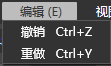
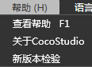
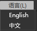

## 菜单栏

### 简介

菜单栏是编辑器常用操作的集合。主要分为文件，编辑，视图，帮助四大类对编辑器进行整体的操作。

### 功能

#### 文件(Alt+F)

##### 新建项目(Ctrl+N)

*   新建游戏项目

创建一个新的游戏项目，内容包含初始化的Cocos2d-x 版本项目。游戏项目可以管理所有的UI项目、动画项目、场景项目。

*   新建UI项目

创建一个新的UI项目，创建后的内容在项目文件夹下的CocoStduio文件夹下的ccsprojs目录内。

*   新建动画项目

创建一个新的动画项目，创建后的内容在项目文件夹下的CocoStduio文件夹下的ccsprojs目录内。

*   新建场景项目

创建一个新的场景项目，创建后的内容在项目文件夹下的CocoStduio文件夹下的ccsprojs目录内。

##### 打开项目(Ctrl+O)

打开已有的场景或游戏项目。如果打开的是场景项目，编辑器将会把场景项目升级为游戏项目。如果需要将场景项目导入到已有的游戏项目请您先打开已有的游戏项目并使用导入项目功能。

##### 保存项目(Ctrl+S)

对当前正在编辑的项目进行保存操作。 

##### 另存为(Ctrl+Shift+s)

将当前项目另存为一个新的游戏项目。

注意：项目名称中不能有下列符号："？"、"、"、"╲"、"*"、"""、"""、"<"、">"、"|"。项目名称尽量不要使用中文。

##### 导出项目

##### 导出资源（Ctrl+E）

导出当前游戏项目中使用的资源。 

##### 导入项目

*   导入UI工程

&nbsp;将一个已有的UI项目导入到当前游戏项目。

>*   导入动画工程

&nbsp;将一个已有的动画项目导入到当前游戏项目。

*   导入场景工程

将一个已有的场景项目导入到当前游戏项目。

##### 导入资源

导入文件 

1.选择磁盘中的文件进行导入，支持多选择导入。

2.遇到同名文件时会提示同名，导入失败。

导入文件夹 

1.选择磁盘中的文件夹进行导入。

2.遇到同名文件夹时会提示同名，导入失败。

##### 退出(Alt+F4)

关闭编辑器。若有已修改项目，软件会提示用户保存项目。 

#### 编辑(Alt+E)

##### 撤销(Ctrl+Z)

撤销上一步操作。

##### 重做(Ctrl+Y)

将撤销的操作恢复。

#### 视图（ALT+V）

##### 隐藏/显示标尺

切换渲染面板的标尺显示状态。

##### 清除参考线

将渲染面板中的参考线移除。

##### 锁定参考线

将渲染面板中的参考线锁定，锁定后的参考将不可移动。

##### 新建参考线

创建一个新的参考线。

提示：可以通过拖拽标尺的方式快速创建参考线。

#### 窗口（ALT+W）

##### 对象结构

打开对象结构窗口。

##### 属性

打开属性窗口。

##### 资源

打开资源窗口。

##### 输出

打开输出窗口。

##### 起始页窗口

打开场景编辑器起始页面。

##### 恢复所有窗口默认布局

将编辑器的窗口布局恢复到初始布局。

#### 设置(Alt+T)

##### 设置模拟器路径

打开模拟器配置路径

#### 帮助(Alt+H)

##### 查看帮助(F1)

查看在线帮助文档。

##### 关于Cocostudio

打开cocostudio信息窗口。

##### 新版本检测

检查是否有新版本，进行版本升级。

#### 语言(Alt+L)

##### English

设置编辑器语言为英文版，重启编辑器后生效。

##### 中文

设置编辑器语言为中文版，重启编辑器后生效。

Copyright © 2013 [CocoStudio.org](http://www.cocostudio.org ""). All Rights Reserved. 版本:1.4.0.0
