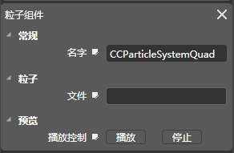

## 粒子[Particle]

### 图标

### 描述

粒子组件包含了渲染plist格式粒子文件的功能，挂载粒子组件之后，空对象变成了粒子对象。

### 属性

[请查看Scene 组件常规属性](5-3-9SceneEditor-General-Property.md)

### 特性

#### 名字

组件名称，在程序中可以通过此名称获取组件（getComponent），组件名称可以被修改，组件的默认名称（CCParticleSystemQuad）。

#### 文件

png文件。

#### 预览（播放控制）

*   播放：播放粒子。
*   停止：停止粒子。 &nbsp;

Copyright © 2013 [CocoStudio.org](http://www.cocostudio.org ""). All Rights Reserved. 版本:1.4.0.0
