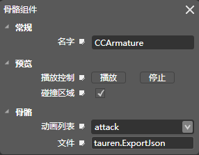

## 骨骼[Armature]

### 图标

### 描述

骨骼动画组件包含了渲染骨骼动画的功能，挂载骨骼动画组件之后，空对象变成了一个动画对象。（骨骼动画是由Cocostudio动画编辑器制作导出）

### 属性

[请查看Scene 组件常规属性](5-3-9SceneEditor-General-Property.md)

### 特性

#### 名字

组件名称，在程序中可以通过此名称获取组件（getComponent），组件名称可以被修改，组件的默认名称（CCArmature）。

#### 文件

json（碎图）格式和exportjson(合图)文件的路径。

#### 动作列表

此动画文件所包含的动作列表。

#### 预览（播放控制）

*   播放：播放当前动作列表所选择的动作。
*   停止：停止播放动画。
*   碰撞区域：显示骨骼的碰撞区域

Copyright © 2013 [CocoStudio.org](http://www.cocostudio.org ""). All Rights Reserved. 版本:1.4.0.0
