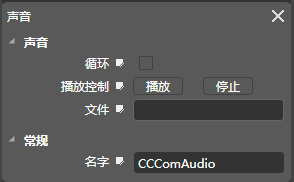

## 音效[ComAudio]

### 图标

### 描述

音效组件包含了播放mp3和wav格式音效的功能，挂载音效组件后，空对象变成了一个音效对象。

### 属性

[请查看Scene 组件常规属性](5-3-9SceneEditor-General-Property.md)

### 特性

#### 名字

组件名称，在程序中可以通过此名称获取组件（getComponent），组件名称可以被修改，组件的默认名称（CCComAudio）。

#### 文件

mp3和wav文件的路径。

#### 循环

设置是否循环播放。

#### 播放控制

*   播放：播放粒子。
*   停止：停止例子。  

Copyright © 2013 [CocoStudio.org](http://www.cocostudio.org ""). All Rights Reserved. 版本:1.4.0.0
