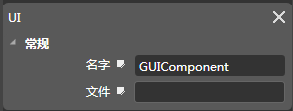

## UI[GUIComponent]

### 图标

### 描述

ui组件包含了渲染ui控件的功能，挂载ui组件后，空对象变成一个ui对象。

### 属性

[请查看Scene 组件常规属性](5-3-9SceneEditor-General-Property.md)

### 特性

#### 名字

组件名称，在程序中可以通过此名称获取组件（getComponent），组件名称可以被修改，组件的默认名称（GUIComponent）。

#### 文件

json（碎图）和exportjson(合图)文件的路径。

Copyright © 2013 [CocoStudio.org](http://www.cocostudio.org ""). All Rights Reserved. 版本:1.4.0.0
