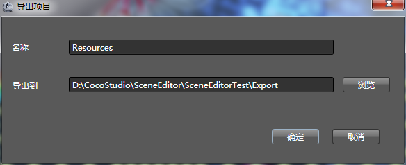

## 项目使用

### 导出

1.  选择**菜单**栏->**导出项目**

  
2.  设置导出目录

  
3.  确认
 

### 复制文件

将导出目录中的文件全部复制到项目的Resources文件夹中

### 使用

将导出后的项目放到资源文件中。

<pre>
 //常见一个新的场景
 CCScene * newscene  = CCScene::create(); 
 //加载导出文件并初始化根节点
 CCNode *pNode = SceneReader::sharedSceneReader()->createNodeWithSceneFile("SceneEditorTest/SceneEditorTest.json"); 

 //通过tag获取音频组件
 CCComAudio *pAudio = (CCComAudio*)(pNode->getComponent("Audio")); 
 //播放音频
 pAudio->playBackgroundMusic(pAudio->getFile(), pAudio->isLoop()); 
 //获取comrender组件
 CCComRender *pFishRender = (CCComRender*)(pNode->getChildByTag(10010)->getComponent( "butterFlyFish")); 
 //转换为armature
 CCArmature *pButterFlyFish= (CCArmature *)(pFishRender->getNode()); 
 pButterFlyFish->getAnimation()->playByIndex(0); 
 //将根节点添加到新场景
 newscene->addChild(pNode, 0, 1); 
 //切换场景
 CCDirector::sharedDirector()->replaceScene(newscene); 
</pre>

Copyright © 2013 [CocoStudio.org](http://www.cocostudio.org ""). All Rights Reserved. 版本:1.4.0.0
