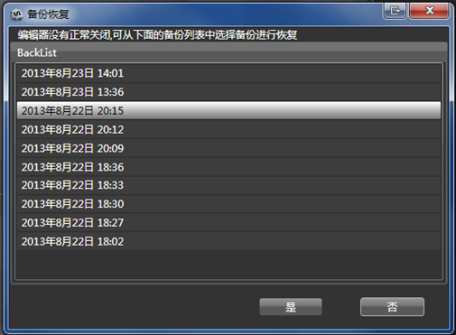

## 备份恢复

### 备份

为了保护用户的数据安全，CocoStudio应用程序会定时自动为用户做备份，用户无需设置。

备份系统会遵循以下规则：

1.每3分钟自动备份一次

2.保存最近10次备份，如果备份超过10次，将旧的备份删除

### 恢复

如果应用程序在编辑项目的时候，发生意外关闭情况（包括但不限于:程序崩溃、系统死机、意外断电）时，用户再次打开原项目，软件会弹出如下备份恢复窗口：

用户可以根据自己的需要，渲染恢复制定时间的备份。

注意

1：备份进行恢复后，该操作无法进行回退；

2：建议恢复前先将项目再做一次拷贝，以防恢复的不是需要的内容。

Copyright © 2013 [CocoStudio.org](http://www.cocostudio.org ""). All Rights Reserved. 版本:1.4.0.0
